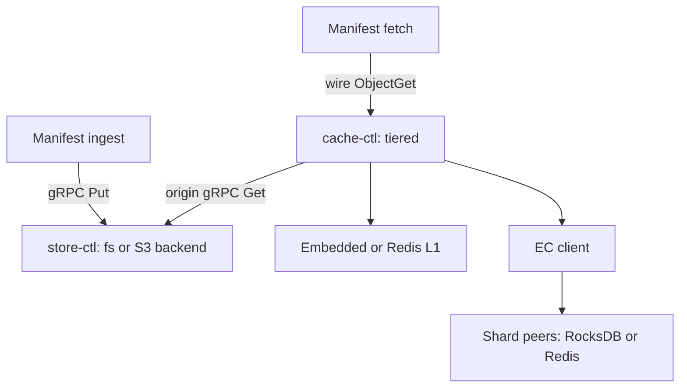
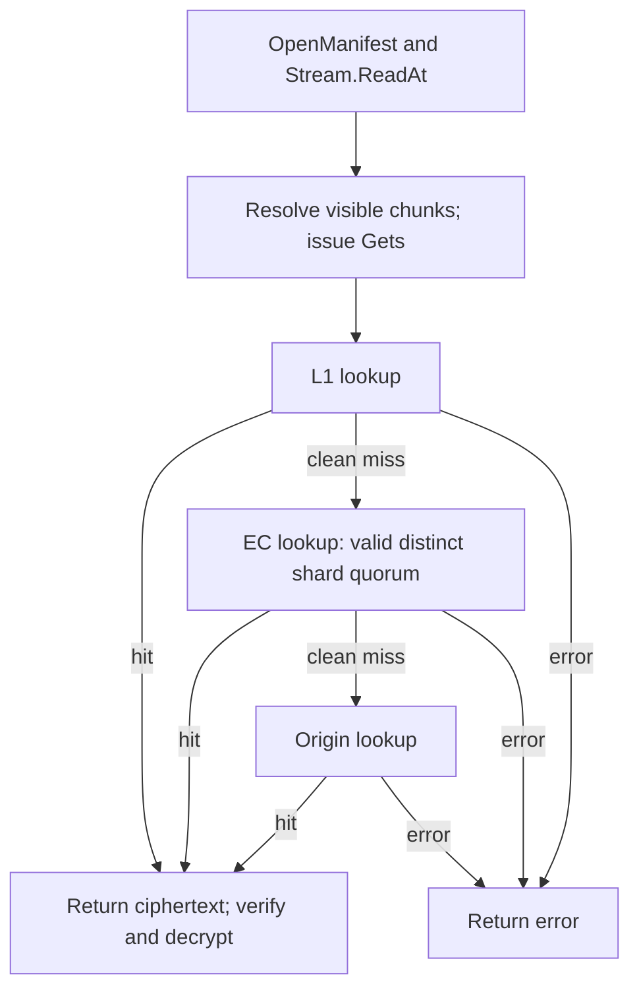

[English](cache.md) | [简体中文](cache_zh.md)

# cache — tiered content caching

`cache-ctl` is the platform's content cache **shared across sandboxes**. It reuses frequently read chunks on one node and across a shard cluster, reducing reads from remote S3-compatible object storage. Embedded deployments can serve hot content from RocksDB BlockCache; a Redis-compatible external backend is also available. One binary supports three YAML-selected modes: `local`, `shard` and `tiered`.

## 1. Overview

### 1.1 Problem

Concurrent consumers often read common immutable chunks. Local and distributed cache tiers reduce repeated origin reads while preserving the Manifest/Store identity and integrity contracts. Reuse depends on the working set, configured security domain, cache capacity and request timing: concurrent misses, eviction and failed fills can cause repeated origin access.

On-demand loading reads the ranges a consumer needs; it does not require every artifact to use a cache or object store. End-to-end startup/restore also includes VMM/guest execution and data-access latency. Cache hit ratios are observed averages with explicit denominators, not per-request bounds. Index/filter residency, false positives, SST/blob reads and compaction affect disk I/O even for a cache deployment.

### 1.2 Principles

- **Data plane:** a custom wire protocol with a 39-byte request header, 8-byte response header and six opcodes.
- **Control plane:** `health_listen` serves both standard `grpc.health.v1.Health` probing and `cac.cache.v1.Info` (`Get` returns runtime counters) on a separate listener.
- **Addresses:** `listen` and `health_listen` accept TCP `host:port` or a Unix socket such as `/run/sandbox/cache.sock` or `unix:///...`. Socket startup handles stale socket paths and sets mode 0600. The data client uses the same address in `cache.endpoint`; use a `unix:///` target for control-plane `ping`/`info --endpoint`.
- **Physical cache backend:** embedded RocksDB or a Redis-compatible server over UDS/TCP. See [the Redis backend guide](cache-redis.md) for configuration, cancellation and an external Dragonfly deployment example.
- **Writes:** no application-level frequency admission filter. Embedded disk eviction uses a CMS-driven RocksDB CompactionFilter; a Redis-compatible server owns its own eviction/capacity policy. Neither policy guarantees a write succeeds through storage/resource failures.
- **Filling:** successful lower-tier reads asynchronously fill upper tiers.

## 2. Command-line interface

For `cache-ctl bench` commands, workload controls and safeguards, see [§7.1](#71-backend-and-wire-benchmarks).

### 2.1 `cache-ctl serve`

```text
cache-ctl serve --config FILE
```

Either `--config` or `CACHE_CONFIG` is required; the flag takes precedence and both missing is an error. See §3 for YAML examples.

### 2.2 `cache-ctl config`

```text
cache-ctl config show     [--config <path>]
cache-ctl config generate
```

`generate` prints a commented template, defaulting to a tiered configuration with embedded RocksDB L1 and a store origin.

### 2.3 `cache-ctl object` — complete objects

Use a data endpoint, conventionally port 7070. The normal intended roles are local for writes and local/tiered for reads; local and shard currently both expose complete-object operations (§4.10).

```text
cache-ctl object get --endpoint host:port --namespace chunk --hash HEX
cache-ctl object put --endpoint host:port --namespace chunk --hash HEX --value FILE|-
```

Supply `--endpoint` or `CACHE_ENDPOINT`. Get writes the value to stdout; `--value -` reads stdin. Tiered rejects Put (§3.1).

### 2.4 `cache-ctl shard` — EC shards

The intended endpoint is a shard daemon:

```text
cache-ctl shard get --endpoint host:port --namespace chunk --hash HEX
cache-ctl shard put --endpoint host:port --namespace chunk --hash HEX --idx N --total M --value FILE|-
```

Get does not supply a shard index: the peer returns the shard it actually holds, with idx/total printed to stderr and shard data to stdout. Put prefixes raw data with `[idx][total]`; total defaults to 5 and idx must be smaller than total. This is a single-peer debugging interface. Normal fill-aside writes use `EncodePrefixed`.

### 2.5 `cache-ctl ping` / `info`

```text
cache-ctl ping --endpoint host:port           # gRPC health listener
cache-ctl info --endpoint host:port [--json]  # Runtime counters on the same listener
cache-ctl info --rocks-path PATH             # Offline read-only RocksDB inspection
```

Ping and remote Info target the **control-plane `health_listen`**, conventionally 7071, not the data listener. They use different gRPC services: `grpc.health.v1.Health/Check` and `cac.cache.v1.Info/Get`. Info prints a table or raw JSON with `--json`.

`info --rocks-path` opens RocksDB through **OpenDbForReadOnlyColumnFamilies**, not a secondary-instance API. Use remote Info to inspect a running daemon; offline read-only opening is intended for postmortem inspection and does not promise a coherent live view while another process modifies the files.


## 3. Configuration

### 3.1 Mode comparison

| Dimension | local | shard | tiered |
|---|---|---|---|
| Intended role | Complete-object KV on one node. | EC shard KV in a cluster. | Ordered multi-tier read proxy. |
| Handler backend | Embedded RocksDB or Redis-compatible. | Embedded RocksDB or Redis-compatible. | TieredCache (§4.6). |
| Tier chain | None. | None. | Exactly the YAML `tiers:` order. |
| Writes | Direct to selected backend; object and shard operations. | Direct to selected backend; object and shard operations. | Rejected with StatusError. |
| Reads | Selected backend. | Selected backend. | Traverse the chain on clean misses; asynchronously fill upper tiers on a hit. |
| Origin dependency | None. | None. | Configured Store/upstream RPC access; remote object-store credentials stay with the service owning that backend. |
| Typical deployment | Tests, debugging or one-node cache. | Five peers for unchanged RS(4+1). | Beside Manifest consumers as a node-local cache proxy. |

### 3.2 Local mode

```yaml
mode: local
type: embedded
listen: 0.0.0.0:7070           # Wire data; TCP or UDS (/run/sandbox/cache.sock or unix:///...)
health_listen: 0.0.0.0:7071    # Optional gRPC Health + Info; UDS also accepted
stats_interval: 30s           # Adaptive stats base period; "0"/"off" disables it
rpc_timeout: ""               # Empty/invalid/nonpositive: no request context deadline
                             # A positive Go duration sets the context budget, not a CGO interrupt

freq:
  counters: 8M                # 4-bit CMS counters; about 4 MiB per active generation
  reset_after: 1M             # Count-triggered rolling decay
  reset_interval: 1h          # Time-triggered decay for low traffic
  evict_threshold: 1          # Evict estimates at or below this threshold
  persist_interval: 5m

rocks:
  path: /var/cache/accel-l1
  disk_bytes: 1TiB            # Sizing input for BlockCache; not an enforced disk quota
  mem_ratio: 0.01             # 1 TiB × 1% = 10.24 GiB
  direct_reads: true
  bloom_bits: 15
```

### 3.3 Shard mode

```yaml
mode: shard
type: embedded
listen: 0.0.0.0:7070
health_listen: 0.0.0.0:7071
rpc_timeout: 2s

freq:
  counters: 32M
  reset_after: 10M
  reset_interval: 6h
  persist_interval: 5m

rocks:
  path: /mnt/ssd/accel-l2
  disk_bytes: 5TiB
  mem_ratio: 0.08             # 5 TiB × 8% = 409.6 GiB
  direct_reads: true
  block_size: 128KiB
  bloom_bits: 15
  write_buffer_bytes: 512MiB
  max_background_jobs: 16
```

### 3.4 Tiered mode

```yaml
mode: tiered
listen: 0.0.0.0:7070
health_listen: 0.0.0.0:7071
rpc_timeout: 2s

freq:
  counters: 8M
  reset_after: 1M
  reset_interval: 1h
  persist_interval: 5m

# YAML order is lookup order; at most one embedded tier
tiers:
  - type: embedded
    rocks:
      path: /var/cache/accel-l1
      disk_bytes: 1TiB
      mem_ratio: 0.01
      direct_reads: true
      bloom_bits: 15

  - type: ec
    cluster:
      data_shards: 4          # Empty/nonpositive defaults to 4 before initial clamp
      parity_shards: 1        # Empty/nonpositive defaults to 1; RS 4+1 has 25% parity overhead
      peers:
        - {id: l2-01, endpoint: 10.0.1.11:7070}
        - {id: l2-02, endpoint: 10.0.1.12:7070}
        - {id: l2-03, endpoint: 10.0.1.13:7070}
        - {id: l2-04, endpoint: 10.0.1.14:7070}
        - {id: l2-05, endpoint: 10.0.1.15:7070}
      pool: 2                 # Wire connections per peer
      timeout: 2s

origin:
  type: store                 # store or upstream; remote authoritative bytes use the service
  store:
    endpoint: 10.0.1.50:7100   # store-ctl gRPC
    pool: 4                   # Independent grpc.ClientConn instances, round-robin
    timeout: 2s
  max_inflight: 16             # Maximum synchronous origin queries
```

`origin.type: store` routes final origin reads through store-ctl gRPC Get. **This does not remove cache-ctl's filesystem access:** embedded RocksDB still reads/writes its cache directory. Only authoritative origin persistence belongs to store-ctl. The other origin type is `upstream`, pointing at another cache wire endpoint.

#### Initial shard-count clamp

Each object places `data + parity` shards on distinct peers selected by Maglev. That total must fit the peer count. Otherwise routing cannot return enough distinct nodes.

At EC construction, defaults are first applied (`data≤0 → 4`, `parity≤0 → 1`). If their sum exceeds `n = len(peers)`, construction logs a warning and reduces the scheme, preferring parity:

- If `parity < n`, use `data = n - parity`, preserving parity.
- If `parity ≥ n`, use `data = 1, parity = n - 1`. With one peer this is `1+0`, no redundancy; absent data is a miss, but reads/writes remain supported.
- If `data + parity ≤ n`, keep the scheme. Selecting only a subset of a larger peer set is valid, distributes objects and can reduce each object's fanout.

A zero-peer configuration is invalid. To retain **4+1**, supply at least five peers initially. The clamp is a **construction-time** operation. SIGHUP updates membership, not the codec's data/parity scheme; reducing live membership below the existing total can produce routing errors (§4.9).

#### Optional upstream tier

A `type: upstream` tier reads/writes complete objects through another cache-ctl wire endpoint. It can sit after an embedded tier and before EC, concentrating hot content in an aggregation node.

For fill-aside, use a **writable complete-object endpoint**. Local is the intended role; current shard mode also exposes object operations (§4.10). Tiered rejects Put. If a read-only tiered endpoint is used as an intermediate upstream tier, reads may work, but async fill errors are discarded and do not populate it. They do not retroactively change the successful read into a miss, and there is no startup write-capability handshake or guaranteed loud first-fill error. A read-only endpoint can instead be an `origin.type: upstream`, which is read only by the proxy.

```yaml
tiers:
  - type: embedded
    rocks: { path: /var/cache/accel-l1, disk_bytes: 1TiB, mem_ratio: 0.01 }

  - type: upstream             # Use a writable complete-object backend for fill-aside
    endpoint: 10.0.1.50:7070
    pool: 4                    # Separate reader/writer ConnPools
    timeout: 2s
```

### 3.5 Important parameters

| Parameter | Meaning |
|---|---|
| `listen` | Wire data listener, TCP or Unix socket. |
| `health_listen` | One gRPC listener for Health probes and Info counter snapshots; omitted means neither service starts. |
| `stats_interval` | Adaptive stderr statistics base period (§6.6), default 30s. `0`/`off` disables it. Active windows print throughput, bandwidth, latency, concurrency, hit cascade and backend gauges; idle windows are silent. |
| `freq.disable_eviction` | Embedded RocksDB frequency tracking continues, but the installed filter remains unarmed and preserves keys. Useful when a test local daemon serves as an origin. It does not turn cache storage into failure-proof authoritative persistence or control external Redis eviction. |
| `pool` | Wire connections to one peer; each connection's synchronous request/response flow serializes its own requests. |
| `max_inflight` | Synchronous tier-query concurrency, 0 for unlimited. Async fill uses backend pools/limits. Redis tiers reject this field; use their separate get_pool/set_pool. |
| `rpc_timeout` | Server request context budget. Missing, empty, invalid or nonpositive means no per-request deadline. A positive duration cancels context-aware work; synchronous RocksDB CGO cannot be interrupted mid-operation. Timeout/errors are not universally converted into cache misses (§4.2). |
| `timeout` | Client per-operation timeout. **An intermediate upstream tier (`tiers[].timeout`) and an EC cluster (`tiers[].cluster.timeout`) default to 2s** when empty/invalid/nonpositive. **Origin clients (`origin.store.timeout` and `origin.upstream.timeout`) default to 0**, bounded by caller/connection lifetime. Redis has its own validation/defaults and requires an explicitly supplied timeout to be positive and valid. |
| `pprof_listen` | Optional HTTP `/debug/pprof/*` listener, for example 127.0.0.1:6060. Leave empty normally; enable temporarily for diagnostics (§6.4). |

## 4. Design

### 4.1 Architecture



Manifest ingest writes directly to store-ctl, bypassing cache-ctl. Cache filling is a separate write path: successful reads trigger TieredCache's internal fill-aside calls, which do not loop through that same daemon's wire listener. Cache Put/ShardPut operations still exist for backend filling and explicit tooling.

### 4.2 Wire protocol

The data plane uses a compact binary protocol instead of gRPC/protobuf. It reduces framing/serialization work and supports Blob ownership across backend/response paths; this alone does not prove a universal throughput gain or eliminate every copy.

#### Frame layout

All integers are little-endian.

```text
Request (fixed 39-byte header + optional Value):
  0   TotalLen     u32   Complete frame length in bytes
  4   Opcode       u8    0x01 ObjectGet / 0x02 ObjectPut
                         0x03 ShardGet / 0x04 ShardPut / 0x05 Ping
                         0x06 CancelRequest
  5   Namespace    u8    0x01 chunk / 0x02 manifest / 0x03 blob; ignored for Ping
  6   Flags        u8    Reserved
  7   Hash         32 B  Content key; zero for Ping
  39  Value        ...   Put only; ShardPut value is [idx][total][shard_data]

Response (fixed 8-byte header + optional ErrMsg + optional Value):
  0   TotalLen     u32
  4   Status       u8    0x00 Hit / 0x01 Miss / 0x02 Error / 0x03 Cancelled
  5   Reserved     u8
  6   ErrLen       u16   Error-message byte length
  8   ErrMsg       ...   UTF-8 error text for Error
  +   Value        ...   Value on Hit; ShardGet carries [idx][total][shard_data]
```

| Constant | Value |
|---|---|
| `RequestHeaderSize` | 39 B. |
| `ResponseHeaderSize` | 8 B. |
| `MaxFrameSize` | 4 MiB. |

MaxFrameSize covers the **whole frame**, including header and payload. Client/server validate TotalLen before accepting the rest of the frame; oversized frames are protocol errors and the connection is closed.

#### Error model

There is no gRPC-style catalog of application error codes. Backend failures and rejected operations use StatusError with text. A **clean final miss uses StatusMiss**, not StatusError.

| Status/result | Wire client meaning | TieredCache behavior |
|---|---|---|
| StatusHit | Value, hit=true, no error. | Return the hit and fill upper tiers. |
| StatusMiss | No value, hit=false, no error. | A clean layer miss proceeds to the next layer. |
| StatusError | An error containing ErrMsg. | **Return the layer error immediately** and increment its error counter; no generic fallthrough. |
| StatusCancelled | Cancellation. | Respect the cancellation/error path; do not treat it as proof of absent content. |

Internally, `CacheHitMiss` is a negative-cache hit that ends lookup with a miss, while `CacheMiss` continues. Waiting for a concurrency semaphore causes lookup to restart at the first tier, because an upper tier may have filled while the request waited.

Individual backends can have their own quorum semantics. For example, insufficient usable EC shards may produce a clean miss, allowing origin lookup; routing, reconstruction and invalid-length errors can remain errors. This does **not** mean every transport error or malformed backend response is interchangeable with a miss. Redis timeout, EOF, protocol and server errors likewise are not ordinary tier fallthrough.

#### Cancellation: CancelRequest / StatusCancelled

A client can send CancelRequest (0x06) while an operation is in flight. The server cancels the handler context and responds with StatusCancelled (0x03), also cancelling pending queued requests on that connection. Context-aware remote hops and origin I/O can stop; synchronous RocksDB CGO cannot be interrupted in the middle of its call, so cancellation is not a universal instantaneous backend-stop guarantee.

Once **data distinct valid shard indexes** have arrived, EC cancels the remaining foreground ShardGet contexts. The wire client interrupts the socket operation through its deadline, joins the cancellation callback and discards that connection. Closing it also cancels the server handler. EC need not wait for every peer to serve the read. A cancelled slow peer is unknown, not a confirmed miss; repair handles that distinction (§4.7).

#### Operations not provided

- **Delete:** no wire deletion operation. Embedded cache eviction is asynchronous CMS/CompactionFilter work (§4.5); external Redis eviction belongs to that server. This says nothing about the separate store generation/GC API.
- **AdminService:** no standalone admin RPC. Info/Get pulls counters (§1.2, §6.3); adaptive stderr statistics are normally enabled (§6.6). Offline diagnostics use read-only `info --rocks-path`, not a secondary-instance API.
- **Streaming:** values are one-shot request/response payloads bounded by MaxFrameSize. EC subdivides storage among peers, but the complete-object response from tiered still must fit a wire frame. It does not make arbitrary-size objects transportable; choose upper-layer object/chunk sizes that fit or use an appropriate non-wire path.

### 4.3 Key encoding and opcode dispatch

| Opcode family | Wire Hash | RocksDB key | Value | Role |
|---|---|---|---|---|
| ObjectGet/Put | 32-byte content key; physical SHA-256 for Manifest/chunk objects. | `hash[32]`. | Raw stored object bytes. | Complete object. |
| ShardGet/Put | The complete object's 32-byte key. | `hash[32] + 0x00`, 33 B. | `[idx:1][total:1][data]`. | RS shard. |

The wire header always carries 32 hash bytes. A shard request does not assert which idx the peer should hold: idx/total travels in the value prefix. The 32-byte object and 33-byte shard keys cannot collide even within one RocksDB CF.

Placing shard identity in the value makes a surviving peer's existing shard discoverable after membership changes. A client uses the reported index rather than assuming a fixed peer-position-to-shard-index mapping. It still needs enough **distinct** valid indexes for the active coding scheme.

### 4.4 RocksDB tuning

| Parameter/option | Default | Meaning |
|---|---|---|
| `disk_bytes` | 1 TiB. | Sizing input, **not an enforced disk quota**. |
| `mem_ratio` | 0.01. | Shared BlockCache budget = disk_bytes × mem_ratio, minimum 64 MiB. |
| `block_size` | 64 KiB. | SST data-block size. |
| `bloom_bits` | 15. | Bits per key for Bloom filters; actual false-positive behavior is not a fixed documented percentage. |
| Compression | None. | Fixed RocksDB option; encrypted chunk values are already high-entropy. |
| `direct_reads` | true. | Enables UseDirectReads for supported reads. |
| `write_buffer_bytes` | 256 MiB. | Configured write-buffer sizing input. |
| `max_background_jobs` | 8. | Used for maximum background compactions; the implementation separately allows two background flushes. |
| Compaction | Leveled/default RocksDB behavior. | Data organization follows the underlying configured options. |
| Pin L0 filters/indexes | true. | CacheIndexAndFilterBlocks plus PinL0FilterAndIndexBlocksInCache; this does not pin every level's metadata forever. |

Index/filter blocks and data blocks share the configured BlockCache. Do not count them as independent guaranteed resident budgets or infer one-I/O reads for every key.

#### Column-family isolation

Chunk, Manifest and blob each have a separate CF:

- **Chunk:** frequent fill-aside writes and comparatively large values, often hundreds of KiB.
- **Manifest:** lower write frequency, values from KiB to several MiB.
- **Blob:** arbitrary content-addressed data, store's third partition; see [store](store.md). It uses the same BlobDB/Bloom/compaction-filter mechanism as the other cache CFs.

Separate CFs isolate write-buffer, filter and compaction state, though they share process resources and BlockCache. Cache eviction is frequency based; cached blob values do not automatically follow store generation deletion because cache keys do not encode generation.

#### BlobDB and write amplification

All three CFs enable RocksDB BlobDB with fixed options, not YAML knobs:

- `min_blob_size = 4 KiB`: smaller values remain inline in SST; values at/above the threshold can reside in separate blob files.
- `blob_file_size = 256 MiB`: target blob-file sizing.
- Blob garbage collection is enabled to reclaim stale/unreferenced blob data.

Large values leave a key/blob reference in the LSM; payloads are appended to blob files, reducing the amount of large-value data rewritten during ordinary key compaction. Actual amplification depends on key sizes, RocksDB format, workload, compaction and blob GC. Fetching a blob value can require additional I/O beyond locating its SST reference.

#### DirectReads

UseDirectReads defaults to true and bypasses the OS page cache for supported data reads.

- **L1 beside Manifest consumers:** it reduces duplicated data caching between RocksDB BlockCache and the OS.
- **Dedicated L2:** it can similarly reduce duplication when a large BlockCache is configured. BlockCache sizing is a deployment choice, not a daemon rule.

It does not mean the process has zero page-cache use, completely self-contained I/O accounting, or no other native/write-buffer memory.

### 4.5 Frequency tracking and disk eviction

Embedded RocksDB maintains a Go Count-Min Sketch. Get/Put touches the key; background compaction invokes the CGO-backed CompactionFilter, which asks ShouldEvict. An estimate **at or below** the threshold (default 1) removes the key.

This is not capacity enforcement. disk_bytes does not make compaction evict enough to avoid a full disk. Monitor disk use, write failures and compaction behavior independently.

```text
On Get/Put:
    sketch.Touch(key)            # Four rows of packed 4-bit counters

On reset_after touches or reset_interval:
    old active becomes previous; create a fresh active generation
    Estimate(key) = active estimate + previous estimate / 2

During background compaction on chunk, manifest and blob CFs:
    if armed and sketch.ShouldEvict(key):
        remove the key
```

Touch hashes the key (O(key length), effectively fixed-size for cache keys). Reset rolls generations; it does not repeatedly halve one array in place. The older generation is discarded at the next rollover.

#### Recovery-time protection

The filter is attached before DB Open, while its sketch is absent and armed=false. Startup/recovery compaction therefore preserves keys. After constructing the sketch and **attempting** to restore the reserved `__freq_sketch__` record, the store installs/arms the filter, unless eviction is disabled.

#### Cold-start protection

Without restored frequency history, old keys have zero estimates and may be removed by compaction. To reduce that problem, the active CMS generation is serialized to the reserved RocksDB key, normally every five minutes and on orderly close. Restart restores the active generation; the previous rolling generation is deliberately not persisted.

This is not an unconditional grace period or durable history guarantee. A missing, corrupt or unreadable checkpoint can leave a fresh sketch, after which the filter is still armed. Persist failures are logged. `freq.disable_eviction` keeps the filter unarmed when the deployment intentionally requires no frequency-based eviction.

#### CMS parameter profiles

The following are the documented L1/L2 configuration profiles. L2 values must be configured; choosing shard mode does not itself select all of them.

| Parameter | L1 profile | L2 profile |
|---|---|---|
| `counters` | 8M. | 32M. |
| `reset_after` | 1M. | 10M. |
| `reset_interval` | 1h. | 6h. |
| `evict_threshold` | 1. | 1. |
| `persist_interval` | 5m. | 5m. |

#### No application-level SLRU/LRU

The cache application does not maintain a second payload SLRU/LRU in Go:

- Avoid duplicating retained chunk payloads in Go heap and RocksDB BlockCache.
- Reduce payload allocation/GC pressure that can affect latency tails.
- Let RocksDB's BlockCache manage RAM reuse and the frequency filter manage embedded disk eviction.

CMS active/previous generations, transient reset/serialization buffers, wire pools, EC work and concurrency consume memory, while RocksDB's native allocations are outside Go heap. Redis backends follow their external server's memory policy.

### 4.6 TieredCache and the read path



Manifest Stream.ReadAt resolves the requested visible runs, fetches Data concurrently and writes their logical ranges. A lower-layer hit asynchronously fills upper cache tiers. For 4+1, EC fans out to five peers and can return once four distinct valid indexes suffice; full reconstruction is needed only when data shards are missing. Read ordering and chunk visibility follow [manifest](manifest.md), including layered sparse semantics.

### 4.7 Fill-aside

A hit in layer i fills every cache tier above it; origin is layer N after N cache tiers.

```text
On a hit at layer i (tiers 0..N-1; origin N):
    upper = min(i, N)
    for j = upper-1 down to 0:
        startFill(j, partition, key, blob)   # asynchronous
```

**Blob ownership:** startFill clones an owned handle for the fill goroutine and defers its Release. The original handle belongs to the Get caller until its response has been written. Both handles reference the same immutable backing allocation; each has an independently owned reference, not an unrelated copy of the data.

**Async behavior:** the read does not await fill completion. Fills use a context derived from TieredCache's base context, normally without a fill-specific deadline; Close cancels and joins them (§6.2). Backend cancellation capabilities and client timeouts still matter, especially synchronous RocksDB CGO. This is not an unconditional guarantee that any wedged backend can be interrupted.

Tests and warmup must confirm availability with actual Get/ShardGet calls, not merely observe that fill goroutines briefly drained. Repeated fills of the same key/bytes are idempotent in the intended content-addressed usage: RocksDB or wire writes overwrite the same value. Fill errors are discarded by startFill and do not retroactively fail the successful read.

#### Missing EC shard repair

For a healthy fixed 4+1 scheme:

| Responses | Foreground result | Repair/fill |
|---|---|---|
| Five valid distinct indexes. | Hit; reconstruct only if needed for the data view. | No missing peer to repair. |
| Four valid distinct indexes and one confirmed miss. | Reconstruct if necessary, then hit. | Async repair only when the missing-index/destination mapping is unambiguous. |
| Fewer than four usable indexes. | Normally a clean EC miss; explicit routing/reconstruction/format errors remain errors. | On a later origin hit, fill-aside can re-encode all five shards. |

Foreground quorum cancellation leaves a peer **unknown**, not missing. A bounded follow-up probe can resolve unknown peers; repair writes only confirmed misses whose missing indexes map exactly to destinations. Transport errors, invalid prefixes, stale coding schemes and ambiguous mappings do not justify overwriting a peer's existing shard. Enough responses is insufficient if indexes are duplicated.

### 4.8 Unconditional admission policy

Put/PutShard has no application-level frequency admission filter. **This does not mean every write succeeds:** read-only mode, disk/resource failure, invalid input or backend errors can reject it.

A normal fill represents a chunk that was just read. An additional W-TinyLFU-style admission rejection could cause the next access to go to origin again, conflicting with progressive warming. Embedded space reclamation instead uses the frequency/compaction policy (§4.5), not admission. Redis-compatible backends own their own eviction decisions.

### 4.9 EC client

The EC client is used as a tier in tiered mode.

#### Reed–Solomon 4/5

- Four data shards and one parity shard, five total, unless initial configuration/clamping selects another scheme.
- Any **four distinct valid indexes** can reconstruct the object in a consistent 4+1 scheme, tolerating one unavailable shard when the remaining data is intact.
- Parity adds 25% relative to logical data, before length-prefix, padding and metadata overhead. Three complete replicas add 200%. Quorum timing depends on topology and load.

#### Padding

The object size need not be divisible by the data-shard count k:

1. Prefix the object with a four-byte little-endian logical length.
2. Pad the combined bytes to a multiple of k.
3. RS Split into k data shards and produce parity.
4. Reconstruct and truncate to the recorded length.

#### Maglev consistent hashing

Shard placement uses the repository's [Maglev implementation](../pkg/maglev/maglev.go). The source-backed comparison is:

| Dimension | Classic ring | This Maglev table |
|---|---|---|
| Lookup | Depends on the chosen ring implementation and number of replicas selected. | Hash the key once, then walk a **prebuilt** table until enough distinct peers have been found; allocate a seen array sized to peer count. This is not a per-query O(M log M) table build. |
| Balance | Depends on virtual-node placement and workload. | Round-robin table construction gives member slot counts differing by at most one for the represented member set. That is table occupancy, not a guarantee of equal request/byte load or independent multi-peer placements. |
| Membership changes | Depends on the scheme and selection policy. | Deterministic reconstruction reduces disruption, but actual changed key/peer sets must be measured; no universal 1/M movement guarantee. |
| Dependency | Implementation-specific. | Local implementation in pkg/maglev. |

| Parameter | Value |
|---|---|
| Table size | 65537, a prime. |
| Hash | Standard-library FNV-1a; two domain-distinguished member hashes for table construction and one content-key hash for lookup. |

Member IDs are sorted before constructing the table, so reordering an otherwise identical valid configuration does not remap it. Configure unique, stable peer identities; shard index is not part of the routing key.

#### Membership changes

The EC router publishes immutable `(epoch, peers, maglev_table)` snapshots through `atomic.Pointer`. New epochs must be strictly increasing. In the daemon, explicit YAML + SIGHUP reload drives changes; a short connection outage does not automatically increment the epoch or recompute placement.

A reload reads/validates YAML, checks that the tier structure is compatible, probes candidate EC peers, and applies the reachable set with a higher epoch. Invalid reloads and a candidate set with no reachable peers retain the old membership. Probing is connection readiness, not proof that every object/shard is present. Subsequent calls use the new snapshot; in-flight work can retain the previous one.

To add/remove a peer, update YAML and send HUP, then inspect the logged membership and actual content availability. New routing excludes removed peers. Measure affected placements rather than assuming exactly 1/M of keys move. **Reload updates peers, not the constructed RS codec**, so retain enough reachable peers for its existing data+parity total; the initial clamp is not repeated during membership replacement.

Change **one peer at a time** for a 4+1 rollout, verify readiness and let repair/warming complete. Replacing two or more simultaneously can exhaust parity and cause misses/origin reads. Even a one-peer change is not a guarantee of zero impact; preexisting loss, membership filtering and origin failures matter.

### 4.10 Mixing operations across modes

Current local and shard modes connect the same selected backend to both object and shard interfaces. Therefore ObjectPut to a shard daemon is accepted by the handler and can really write a complete object. This reflects a primary deployment role, not exclusive protocol permission.

Tiered exposes only the object read chain. It rejects writes and shard operations. The protocol should not be mistaken for an authorization boundary; endpoint access belongs to the deployment.

### 4.11 Read attempts, pool recovery and error ownership

Cache reads are single-attempt operations. `Get`/`GetShard` release or cancel failed payloads and streams; a later call starts a complete new object read at the same selected endpoint and never splices an old prefix. A confirmed miss remains distinct from inability to contact a peer, and legal server cancellation remains retryable. Existing endpoint, pool and per-operation timeout settings remain authoritative; socket/RPC deadlines bound one attempt, while the caller's operation context decides whether another attempt is allowed. No retry flag, fallback endpoint, health mask, service restart or compatibility mode is added.

Connection capacity counts idle, borrowed and dialing connections under the same reservation limit for Acquire and refill. Pool dialing has a bounded connection timeout even when no read deadline is configured. Failed dials release their reservation and return the actual error. Bad connections release capacity and wake waiters even when no healthy connection is returned; canceling/taking waiters transfer a consumed notification when spare capacity remains. Close prevents new publication, wakes waiters and cancels dials, while borrowed connections remain caller-owned until Release. Release and Close serialize publication, and socket cancellation must finish before connection ownership returns to the pool. Same-endpoint recovery does not require per-read Ping or whole-pool invalidation. The idle Acquire path continues to use the connection channel without the publication mutex; failed attempts create no unbounded refill tasks, and only bounded maintenance workers perform health/refill work across an outage.

`pkg/readerr` classification used by cache callers is preserved across wrappers: confirmed miss is not a transport failure, unknown errors are not automatically permanent, and permanent semantic causes remain visible through joined/wrapped errors. Consumers, not accelerator, own business retry/backoff.

## 5. Memory budgeting

### 5.1 L1: an embedded tier inside a tiered process

The configured BlockCache is one major native-memory allowance, not a complete process limit. Account separately for memtables/write buffers, native metadata, BlobDB/compaction activity, wire payload pools, active/previous CMS generations and transient buffers. Cached index/filter blocks share the configured BlockCache; do not count them again as independently pinned memory.

Derive the cache allowance from the actual sizing configuration and minimum size in the embedded-backend contract (§4.4). Go heap, in-flight request/fill concurrency and native/OS memory are workload-dependent. DirectReads can reduce supported data-read page caching but does not imply zero process-wide page-cache use. Measure the whole process/cgroup rather than treating one allowance as an enforced total.

### 5.2 L2: dedicated shard nodes

Size shard nodes from their actual physical keys, shard coding, CF distribution and object-size distribution. An idealized Bloom bit budget is `actual keys × bits per key / 8`; index and per-entry/native overhead are separate and should be measured. Do not multiply the entire logical dataset by every CF or equate complete-object count with encoded shard-key count.

L0 pinning and cached indexes/filters can reduce I/O but do not prove all metadata stays resident, zero-I/O misses or single-I/O hits. Bloom false positives, SST traversal and BlobDB payload reads remain possible. Validate memory and disk behavior under actual cold reads, fills, repair and compaction, leaving operating margin rather than copying a historical host allocation.

## 6. Operations

### 6.1 Startup

```bash
# L2 shard peer
cache-ctl serve --config /etc/cache/shard.yaml

# Tiered proxy beside Manifest consumers
cache-ctl serve --config /etc/cache/tiered.yaml
```

### 6.2 Signals and shutdown

SIGINT/SIGTERM trigger:

1. Stop the health monitor and, if enabled, mark gRPC health NOT_SERVING so orchestration can stop routing new work.
2. Stop accepting wire connections and close all tracked connections, including active ones. The wire `GracefulStop` waits up to five seconds for connection goroutines. Closing a connection can cancel its handler and discard its response; it does not guarantee successful draining of in-flight requests.
3. Gracefully stop the shared gRPC Health/Info server.
4. In tiered mode, cancel/join asynchronous fills through TieredCache.Close, then close the origin and constructed tier resources through their registered cleanup. Tier resources close in **reverse YAML construction order**, not a fixed embedded→Redis→EC→upstream type order. Local/shard closes its selected backend.

Clients can observe cancellation, EOF, or another connection error during shutdown. Retry eligible operations against a healthy endpoint according to caller policy; loss of a response does not prove that a write was never applied. The five-second wire wait is not a five-second bound on the entire process shutdown: other cleanup and backend calls can take longer. SIGHUP reloads EC membership as described in §4.9.

### 6.3 Runtime counters: pull-only

Pull cumulative counters through `cac.cache.v1.Info/Get` on health_listen. `cache-ctl info --endpoint host:port` returns one snapshot, as a table or raw JSON. It includes server hits/misses/fills, tier/origin counters, EC peer counters and backend information, including embedded/local/shard RocksDB CF properties and Redis-specific gauges.

Benchmark scripts compare snapshots before/after the window. Individual atomic counters are useful cumulative evidence; the entire multi-counter response is not a transactional point-in-time snapshot. For routine observation, use the adaptive statistics line (§6.6) without repeatedly pulling Info.

### 6.4 Offline inspection

```bash
cache-ctl info --rocks-path /var/cache/accel-l1
```

The tool opens DB files through OpenDbForReadOnlyColumnFamilies and prints properties such as estimated keys, disk usage and compaction statistics. It is intended for offline/postmortem inspection; it is **not** a RocksDB secondary instance and does not promise a coherent concurrent view of a live writer. For a running service, use Info over gRPC.

A nonempty pprof_listen starts an HTTP `/debug/pprof/*` listener. Use `go tool pprof` for CPU, heap or goroutine investigation. Leave it empty during normal operation and enable only for the diagnostic need.

### 6.5 Slow/stalled request tracing: `CACHE_CTL_DEBUG`

Without a configured request deadline, a blocked backend may wait until caller/connection cancellation. The environment-controlled tracer makes slow/in-flight work visible:

```bash
CACHE_CTL_DEBUG=1 cache-ctl serve --config cache.yaml
CACHE_CTL_SLOW=2s CACHE_CTL_DEBUG=1 cache-ctl serve ...
```

- A truthy CACHE_CTL_DEBUG enables tracing. Disabled tracing retains only its small enable-check overhead; “zero overhead” is not literal.
- Only requests exceeding CACHE_CTL_SLOW, a Go duration defaulting to one second, generate slow-request WARN lines. Fast requests are silent; steady throughput/latency belongs to §6.6.
- A background reporter periodically reports still-running operations beyond the threshold, with operation name and elapsed time. Visibility does not require waiting for a request deadline.
- Coverage is the wire handler operation, including tier traversal and origin lookup inside that request.

Separately, **CACHE_CTL_TIMING=1**, read at process startup, enables sampled EC Get timing: LocateN, fanout, decode and shard arrival offsets. Sampling is 1%; it is disabled by default. This targets EC quorum/hedging tails and is independent of CACHE_CTL_DEBUG.

Both normally stay disabled. They complement pprof: operation traces identify slow/stalled requests; profiles identify where time/resources are spent.

### 6.6 Adaptive statistics: `stats_interval`

The daemon normally emits runtime statistics to stderr on a **30-second base period**, following the same adaptive approach as sandbox-ctl. Active windows produce a summary, idle windows are silent. Startup uses two-second sampling to catch cold-start bursts, then returns to the base period after two idle samples. `stats_interval: 0`/`off` disables output.

A line contains:

- **Throughput:** Get/Put operations per second with adaptive units such as 1.2k or 3.4M.
- **Bandwidth:** outbound Get and inbound Put bytes per second.
- **Hits:** window server hit ratio; tiered additionally reports the tier/origin hit cascade, such as `hits L0 88% L1 6% origin 6%`.
- **Latency:** separate Get/Put p50, p99 and maximum from window histograms using the sandbox-ctl bucket scheme.
- **Concurrency:** in-flight Get+Put and current wire connection counts.
- **RocksDB gauges:** per-CF keys, live data size and running compactions, when applicable.
- **Errors:** StatusError responses in the window, omitted when zero.

Illustrative formatting:

```text
cache stat tiered | get 5.1k/s 620MiB/s p50 40µs/p99 700µs/max 9ms · hit 94% | inflight 18 conns 6 | hits L0 88% L1 6% origin 6% | rocks chunk 1.2M keys/3.4GiB
```

This is a format example, not a fresh benchmark. In tiered mode, internal fill writes are not inbound wire Put operations; do not infer support for client Put from an illustrative statistics line.

Adaptive statistics give ongoing window-level visibility; Info provides cumulative values for scripts and benchmark deltas. CACHE_CTL_DEBUG instead focuses on abnormal long tails.

## 7. Performance characteristics

Measure local, shard and tiered paths separately, recording source/binary revisions, hardware, backend configuration, object sizes, concurrency, cache state and failures. Define timing boundaries and hit/miss denominators before comparing measurements. Conditional per-tier hit rates cannot simply be added. No universal latency, hit-rate or capacity guarantee follows from a cache topology.

Use the [project performance methodology](https://github.com/kuasar-sandbox/kuasar-sandbox/blob/main/docs/perf.md) and [Redis-compatible backend guide](cache-redis.md) for evidence and external-service deployment validation. Existing commands and safeguards follow below.

### 7.1 Backend and wire benchmarks

The built-in benchmark sends wire-protocol traffic to a running daemon for quick throughput/latency smoke checks. It does not replace [bench_cache.sh](../test/scripts/bench_cache.sh), which adds CPU affinity and parameter sweeps.

```text
cache-ctl bench --endpoint host:port [flags]

Flags:
  --concurrency int          (default 8)
  --duration duration        Go duration (default 10s)
  --value-size int           (default 262144; 256 KiB)
  --mode string              get | put | mixed; empty defaults to mixed without
                             prefill; with prefill, empty/mixed are changed to get
  --namespace string         chunk | manifest
  --prefill int              Objects prewritten for get/mixed (default 1000)
  --prefill-endpoint string  Separate prefill endpoint (default: benchmark endpoint)
  --info-endpoint value      Repeatable Info gRPC endpoint; the first also controls
                             benchmark-target warmup checks
  --access string            seq | uniform | zipf (default seq)
  --zipf-s float             Zipf s > 1; larger is more skewed (default 1.1)
  --cold-prefill int         Cold keys written only to prefill, not warmed at target
  --miss-ratio float         Read share targeting cold keys; requires cold-prefill
                             and a separate prefill endpoint
  --key-salt string          Isolate deterministic warm/cold/write key spaces
                             (default empty; use a unique value per isolated run)
  --timeout duration        Per-operation client deadline (default 10s)
  --cpu-profile string      CPU-profile file for the measurement window
  --heap-profile string     Heap-profile file written after the window
  --trace string            Execution-trace file for the window
```

With a separate prefill endpoint, both an omitted mode and explicit `--mode mixed` are changed to `get`; `put` and other modes are rejected. Inspect the reported effective mode before interpreting results. `--key-salt` participates in warm, cold, and write-key derivation: repeated or concurrent runs with the same salt reuse deterministic keys and can contaminate intended cold reads or overwrite prior writes. Use a unique salt for each isolated run. `test/scripts/bench_cache.sh` supplies a run/round/mode/concurrency salt; `test/scripts/bench_cache_remote.sh` currently does not pass `--key-salt`, so its concurrency sweep can reuse keys warmed by earlier rounds. Do not treat those later rounds as isolated cold-cache measurements without adding distinct salts at invocation or resetting the relevant cache state. Increase the client timeout when an intentionally slow origin or large prefill requires it; a timeout does not convert a backend error into a clean cache miss.

#### Backend A/B benchmark

The repository's existing cache wire benchmark can select the physical store
without changing its client workload:

```bash
# Embedded RocksDB baseline.
SERVER_CORES=0-7 CLIENT_CORES=8-11 \
  PREFILL=1000 DURATION=5s \
  ACCESS=uniform GET_CONCS='1 4 16 32' MIXED_CONCS=8 \
  bash test/scripts/bench_cache.sh

# Redis-compatible local backend. Start a disposable, empty server first.
BENCH_BACKEND=redis REDIS_RESET=flushdb \
  REDIS_ENDPOINT=unix:///run/kuasar-bench/redis.sock \
  SERVER_CORES=0-3 BACKEND_CORES=4-7 CLIENT_CORES=8-11 \
  PREFILL=1000 DURATION=5s \
  ACCESS=uniform GET_CONCS='1 4 16 32' MIXED_CONCS=8 \
  bash test/scripts/bench_cache.sh
```

`bench_cache.sh` manages only cache-ctl processes. The Redis-compatible server
is an external deployment component, so the operator must pin its process to
`BACKEND_CORES`, give the benchmark an isolated namespace, and stop it after
the run.
`BACKEND_CORES` is recorded in the report but is not applied by the script.
Report both cache-ctl and backend CPU allocations; comparing an unbounded
Dragonfly process with a bounded embedded process is not a valid A/B.
`REDIS_RESET=flushdb` is deliberately explicit and destructive: every endpoint
must be dedicated to the benchmark. The harness clears it before the first
point and between points, then restarts its cache-ctl daemons. Embedded runs
recreate their RocksDB paths instead. This keeps capacity and cold-key state
identical across the sweep. External cache-ctl mode cannot reset backing state
and accepts only one point per invocation. In that mode, Redis endpoint, pool
and timeout fields are reported only when explicitly provided; otherwise the
report marks them as unknown.
With no phase override, external mode runs one GET point at concurrency 1.
Setting `GET_CONCS`, `PUT_CONCS`, or `MIXED_CONCS` makes unspecified phases
empty, and the selected phase must still contain exactly one point. A pool size
of zero is reported as its effective cache-ctl default (32 GET, 8 SET).

In external split-prefill mode, the single point must be GET, not PUT/mixed. Both harness-owned tiered scenarios start an embedded RocksDB origin even when the measured backend is Redis, so they require the normal RocksDB-enabled binary. `no_rocksdb` can serve Redis local/external scenarios but not that built-in embedded origin. Set `KEEP_WORKDIR=1` when retaining evidence: by default the local harness deletes its temporary configs, raw outputs/TSV and profiles on exit, including failure.

For the EC path, provide exactly five independent Redis endpoints:

```bash
BENCH_SCENARIO=tiered-shard-l2 BENCH_BACKEND=redis REDIS_RESET=flushdb \
  REDIS_SHARD_ENDPOINTS='unix:///run/df1.sock unix:///run/df2.sock unix:///run/df3.sock unix:///run/df4.sock unix:///run/df5.sock' \
  SERVER_CORES=0-3 BACKEND_CORES=4-7 CLIENT_CORES=8-11 \
  ACCESS=uniform GET_CONCS='1 4 16 32' \
  bash test/scripts/bench_cache.sh
```

Each shard peer owns a physical storage namespace. Pointing multiple shard
peers at the same Redis namespace is invalid because their values for one
content key represent different EC shard indexes and would overwrite each
other. In production those endpoints normally reside on different nodes; a
single-host benchmark must use separate server instances or otherwise
isolated namespaces.

Hot-hit acceptance requires a working set that fits the configured memory.
SSD-tier acceptance requires a uniform working set larger than the server's
RAM budget, observed offloaded-entry and pending-I/O metrics, and storage that
matches the production NVMe class. Results from a virtual block device may be
used for functional tiering tests but not for the production latency claim.

[Dragonfly SSD tiering](https://www.dragonflydb.io/docs/managing-dragonfly/tiering)
currently requires Linux 5.19 or newer with `io_uring`. Capacity and latency
acceptance must include active offload/defragmentation and near-full disk
states; the systemd sample is deployment scaffolding, not a performance
qualification result.

#### Multi-host benchmark and cleanup safety

Use dedicated, disposable benchmark hosts and replace the documentation addresses below with the intended isolated topology. The generated data, health and profiling listeners bind `0.0.0.0` on ports `17070–17072`, `17080–17082` and `17090–17092`; restrict network access before startup. Use a binary matching the remote architecture and libc, and passwordless SSH with independently verified host keys. The explicit `SSH_OPTS` below overrides the harness's disabled host-key checking.

Choose a fresh, simple relative `REMOTE_DIR` beneath the remote user's home and a dedicated `RESULTS_DIR`. Shell interpolation in this harness is not a safe path-sanitization boundary: do not use whitespace, shell metacharacters, traversal, broad directories or shared data locations.

```bash
make cache-ctl
export SHARDS='192.0.2.11 192.0.2.12 192.0.2.13 192.0.2.14 192.0.2.15'
export ORIGIN_HOST=192.0.2.21 TIERED_HOST=192.0.2.21 BENCH_HOST=192.0.2.21
export BINARY=bin/cache-ctl REMOTE_DIR=cache-bench-run-001
export RESULTS_DIR=build/cache-bench-run-001
export SSH_OPTS='-o ConnectTimeout=30 -o StrictHostKeyChecking=yes -o BatchMode=yes'
export ACCESS=uniform CONCS='4 16 64' DURATION=30s
bash test/scripts/bench_cache_remote.sh deploy
bash test/scripts/bench_cache_remote.sh start all
bash test/scripts/bench_cache_remote.sh health
bash test/scripts/bench_cache_remote.sh bench
bash test/scripts/bench_cache_remote.sh report
bash test/scripts/bench_cache_remote.sh stop
```

`deploy` overwrites remote binaries/configuration. `bench` removes remote `results/bench-c*.*`, then copies results over corresponding local files; unrelated/stale local concurrency logs remain. `report` overwrites both generated report READMEs in `RESULTS_DIR`. Preserve previous evidence first and keep each run's results separate. The remote benchmark pipes output through `tee` without enabling remote `pipefail`; SSH success alone does not prove benchmark success. Inspect raw logs, errors and the expected completed measurements.

`stop` uses broad `pkill -f 'cache-ctl serve'` on the selected hosts, not run-specific PIDs. A separate directory does not isolate processes; remote stop failures can be ignored by the script, so verify that the intended processes actually stopped. Never use these hosts if they run unrelated cache-ctl services.

`clean` first stops services, then removes remote `rocks-*`, the entire `results` directory and top-level `*.log` under `REMOTE_DIR`, plus local `bench-c*.log`/`bench-c*.pprof` under `RESULTS_DIR`. Inspect exact hosts and disposable paths before requesting cleanup. `all` performs clean → deploy → start → health → bench → report and **does not stop services at the end**. Use the explicit individual commands above; never run `stop`, `clean` or `all` against shared services or non-disposable data.

Record workload controls `VALUE_SIZE`, `PREFILL`, `COLD_PREFILL`, `MISS_RATIO`, `ACCESS`, `ZIPF_S`, `CONCS`, `DURATION`, `TIMEOUT`; topology/coding controls `EC_DATA`/`EC_PARITY`; and backend controls `SHARD_DISK`, `SHARD_MEM_RATIO`, `SHARD_BLOCK_SIZE`, `DIRECT_READS`, `BLOOM_BITS`, `ORIGIN_DISK`. Generated shard/origin configurations default to `freq.disable_eviction: true`, so they do not validate aging unless an owned benchmark configuration deliberately enables it and the report records that choice. The remote sweep supplies no key salt and does not reset caches between concurrency points; later points are not isolated cold-cache measurements.

#### Benchmark methodology: L2 memory/disk, L3 and aging

[bench_cache_remote.sh](../test/scripts/bench_cache_remote.sh) deploys N shards, origin and tiered daemons for a multi-host concurrency sweep. Its `report` subcommand emits complete `README.md` / `README_zh.md` reports with reciprocal selectors from the same parsed rows. It reads the current `hit%` column after `end-flight` and `errors`; origin-hit share counts successful origin reads divided by benchmark ops, excluding origin misses/errors. Missing cache counters remain unknown. Read-through and reused unsalted keys mean these observations need not equal `--miss-ratio`. Pair it with [procmon.sh](../test/scripts/procmon.sh), a dependency-free /proc CPU/diskstats/network sampler, and [proc_analyze.py](../test/scripts/proc_analyze.py) to attribute resource use.

- **L2 memory versus disk:** compare the working set with `rocks.disk_bytes × mem_ratio`, accounting for index/filter usage inside the BlockCache budget. A working set well below available cache can be RAM-hot; one much larger than it can exercise real random disk reads.
- **Access distribution:** uniform reads spread over the working set and expose the disk path. Zipf models hot-content skew, but excessive skew can fit the effective hot set in RAM and conceal disk behavior. Use uniform access or a much larger working set when measuring disk.
- **EC hit rate is not RAM hit rate:** an EC hit means the shard cluster supplied enough data. RocksDB BlockCache misses and disk reads occur below that counter. Inspect shard-host disk IOPS, such as procmon `rd_iops`, to establish that the workload actually reached disk.
- **L3 modeling:** `--cold-prefill N` writes only to origin, while `--miss-ratio f` selects those cold keys for roughly fraction f of reads. Repeated cold keys warm through fill-aside, lowering the measured origin-read ratio. Size the cold pool larger than the expected cold reads during the window.
- **Aging/eviction:** embedded eviction is frequency based (§4.5), not a disk_bytes quota. A short run with total operations far below reset_after may not exercise count-driven decay; the time-driven reset can still fire, and once-touched keys can already be at or below the eviction threshold. Use a long window and skewed access, observing actual sketch/compaction behavior rather than assuming short runs cannot evict.
- **Possible bottlenecks:** RAM-hot shard reads can saturate coordinator network/copy/CPU resources; disk-heavy working sets can saturate shard random I/O and amplify quorum tails. EC collects approximately one object's worth of data across data shards, with parity/hedging/protocol overhead, not automatically `value-size × data_shards` full-object bytes. Neither “the NIC always bottlenecks first” nor “CPU is usually irrelevant” is hardware-independent. Measure network, disk, CPU, concurrency and latency together. Keeping a measured hot set resident can improve performance, but no fixed order-of-magnitude gain follows from the architecture alone.

## 8. See Also

- [store](store.md): a tiered origin can use store-ctl gRPC or another cache wire endpoint. Embedded cache-ctl still has local filesystem I/O; authoritative origin persistence belongs to store-ctl. Its optional cache_listen exposes a **read-only** chunk/Manifest/blob wire interface with no L1, allowing direct wire reads without a separate cache daemon.
- [manifest](manifest.md): the Fetcher uses wire ObjectGet when cache is configured; Manifest chunk hashes are the corresponding physical ContentKeys.
- [project performance guide](https://github.com/kuasar-sandbox/kuasar-sandbox/blob/main/docs/perf.md): cache measurement and evidence limits.
- [README](../README.md) / [Makefile](../Makefile): `make cache-ctl` builds the repository's CGO binary after deps-rocksdb, statically linking librocksdb.
- [system architecture](https://github.com/kuasar-sandbox/kuasar-sandbox/blob/main/docs/kuasar-sandbox.md): the cache model in the platform.

Cache read attempts and client recovery are specified in [§4.11](#411-read-attempts-pool-recovery-and-error-ownership).
