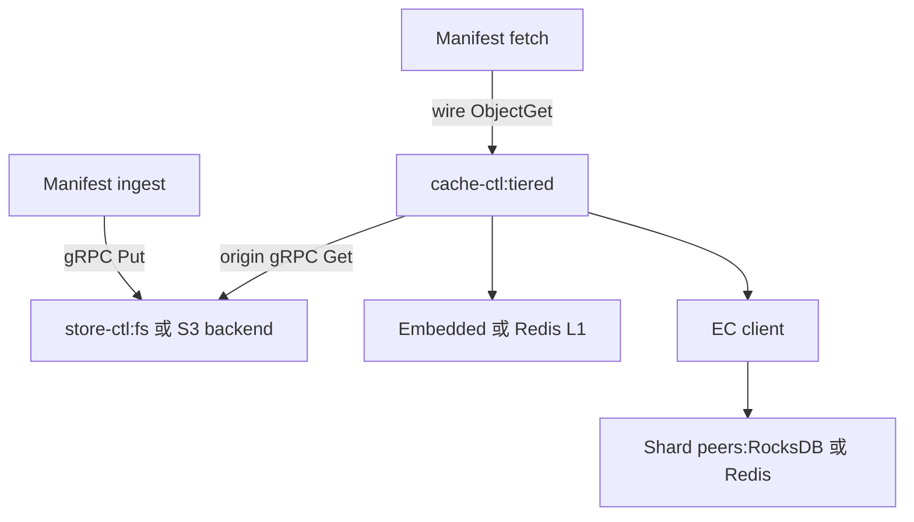
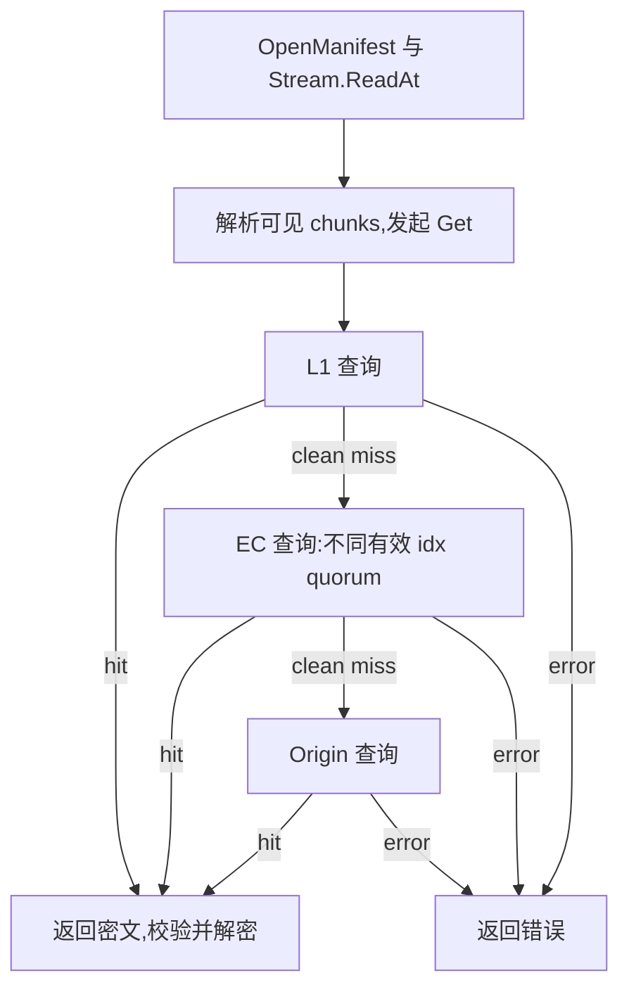

[English](cache.md) | [简体中文](cache_zh.md)

# cache — 分层内容缓存

`cache-ctl` 是项目里**跨 sandbox 共享**的内容缓存层。它把客户端反复
读取的 chunk 在节点本地与节点间集群里重复使用,把远端 S3-compatible
object storage 的读取。embedded 部署可从本地 RocksDB BlockCache 服务热点,
也支持外部 Redis-compatible backend。同一份二进制,
通过 YAML 配置切换三种运行形态(`local` / `shard` / `tiered`),
适配不同部署场景。

## 1. 概述

### 1.1 解决的问题

旧规划以 1–5 GiB 镜像、约 512 MiB 内存快照及万级并发消费者为例。每个消费者都从
远端 S3-compatible object storage 拉取完整副本,可能带来显著时延与聚合带宽需求。

原文没有为下表附上可复现负载与运行记录,因此保留为**历史规划比较**,不是当前实现保证:

| 维度 | 旧无缓存比较 | 旧缓存目标 | 实际依赖与边界 |
|---|---|---|---|
| 镜像冷启动 | 全量拉取为秒级 | 按需加载/命中 <500 ms | 工作集、格式、VM/runtime 启动、cache 状态及后端延迟;按需加载不必然要求命中缓存 |
| 快照恢复 | 数百 ms | L1/L2 命中 <80 ms | 快照/负载、fault 数、存储/网络与 Host |
| 网络流量 | 随消费者增加 | 仅首次 miss 回源 | 复用可减少远端读取,但淘汰、并发 miss、fill 失败和新内容仍会重复回源 |
| 对象存储成本 | 随消费者增加 | 流量降低 >99% | 取决于实际请求/字节命中率与服务计价,无固定降幅保证 |

实测联合命中率 99.9% 表示测量窗口中**平均**约每千次查询一次 miss,不是任意一千次
最多一次。5 TiB 工作集也不保证每次至多一个随机 I/O;Index/Filter 驻留、SST/blob 读取、
假阳性与 compaction 均影响 I/O(§4.4、§5)。

### 1.2 设计原则

- **数据面**:自定义 wire 协议(39 B 请求头 / 8 B 响应头,6 个 opcode)。
- **控制面**:`health_listen` 独立端口同时跑两个 gRPC 服务——标准 `grpc.health.v1.Health`
  探活,以及 `cac.cache.v1.Info`(`Get` 拉运行时计数快照)。
- **监听地址**:`listen` / `health_listen` 均取 `host:port`(TCP)或一个 Unix
  socket 路径(`/run/sandbox/cache.sock` 或 `unix:///...`;为 socket 时启动清死
  socket、chmod 0600)。数据面客户端 `cache.endpoint` 填同址即可;控制面经 socket
  时,`ping` / `info --endpoint` 用 `unix:///` 形式。
- **本地存储**:进程内 RocksDB,或通过 UDS/TCP 访问 Redis-compatible server;
  后者的配置、取消语义和外部 Dragonfly 部署示例见 [cache-redis.md](cache-redis.md)。
- **写入语义**:无应用层频率准入过滤。embedded 淘汰由 RocksDB CompactionFilter
  按 CMS 驱动;外部 Redis server 管理自己的淘汰/容量。两者都不保证存储/资源故障时写入成功。
- **填充语义**:fill-aside,读路径上隐式回填上层。

## 2. 命令行接口

### 2.1 `cache-ctl serve`

```
cache-ctl serve --config FILE
```

`--config` 与 `CACHE_CONFIG` 必有其一(flag 优先);两者皆缺则报错。
YAML 示例见 §3。

### 2.2 `cache-ctl config`

```
cache-ctl config show     [--config <path>]
cache-ctl config generate
```

`generate` 输出带注释模板(默认 tiered:rocksdb L1 + store origin)。

### 2.3 `cache-ctl object` — 完整对象操作

使用数据端点,通常 7070。预期 local 用于写、local/tiered 用于读;当前 local/shard
实际都暴露完整对象操作(§4.10):

```
cache-ctl object get --endpoint host:port --namespace chunk --hash HEX
cache-ctl object put --endpoint host:port --namespace chunk --hash HEX --value FILE|-
```

`--endpoint` 与 `CACHE_ENDPOINT` 二选一;`get` 输出到 stdout;
`--value -` 从 stdin 读。`put` 不可连 tiered(拒绝写,§3.1)。

### 2.4 `cache-ctl shard` — EC 分片操作

连 `shard` 端点:

```
cache-ctl shard get --endpoint host:port --namespace chunk --hash HEX
cache-ctl shard put --endpoint host:port --namespace chunk --hash HEX --idx N --total M --value FILE|-
```

`get` 不带分片编号——返回该 peer 实际持有的分片(`idx`/`total` 打到 stderr,
分片数据到 stdout)。`put` 把裸分片数据按 `[idx][total]` 前缀封装后写入
(`--total` 默认 5,须 `--idx < --total`),是单 peer 的调试入口;真实写入由
fill-aside 经 `EncodePrefixed` 完成。

### 2.5 `cache-ctl ping` / `info`

```
cache-ctl ping --endpoint host:port            # gRPC 健康探测 (--endpoint 指向 health_listen)
cache-ctl info --endpoint host:port [--json]   # 实时 stats(同 health_listen);--json 输出原始 JSON
cache-ctl info --rocks-path PATH               # 离线只读打开 RocksDB,查看属性
```

`ping` / `info --endpoint` 都指向**控制面**端口(`health_listen`,典型 7071),
**不是**数据端口,都不走 wire 协议。两者调不同 gRPC 服务:`ping` 调
`grpc.health.v1.Health/Check`;`info --endpoint` 调 `cac.cache.v1.Info/Get`,把运行时
计数快照拉回来(`--json` 输出原始 JSON,否则人类可读表格)。
`info --rocks-path` 调用 **OpenDbForReadOnlyColumnFamilies**,不是 secondary API。
检查运行中 daemon 应用远端 Info;本地只读打开用于离线/故障后检查,不承诺其他进程修改
DB 文件时得到一致 live view。

### 2.6 `cache-ctl bench`

内置吞吐/延迟基准,通过 wire 协议向运行中的 cache-ctl 发压。用于快速
smoke 验证;不替代 `test/scripts/bench_cache.sh`(后者加 taskset CPU 固
定 + 参数扫描)。

```
cache-ctl bench --endpoint host:port [flags]

Flags:
  --concurrency int         (default 8)
  --duration duration       Go duration (default 10s)
  --value-size int          (default 262144)  # 256 KiB
  --mode string             "get" | "put" | "mixed";默认空,--prefill-endpoint 为空时解析为
                            "mixed"；有 prefill 时空值/显式 mixed 都改为 get，put 等其他值报错
  --namespace string        "chunk" | "manifest"
  --prefill int             get/mixed 模式预写对象数 (default 1000)
  --prefill-endpoint string 独立预写端点(默认同 --endpoint)
  --info-endpoint value     Info gRPC 端点(HealthListen)，可重复；第一个端点同时用于 bench 目标预热判定
  --access string           "seq" | "uniform" | "zipf" 读访问模式 (default "seq")
  --zipf-s float            Zipf 偏斜指数 s (>1,越大越偏;仅 --access zipf) (default 1.1)
  --cold-prefill int        额外只写 prefill 端点、不暖 bench 目标的冷 key 数(喂 L2-miss → L3)
  --miss-ratio float        命中冷 key 的读比例 → L2 miss → 透传 origin/L3 (需 --cold-prefill>0 + --prefill-endpoint)
  --key-salt string         隔离 deterministic warm/cold/write key 空间(默认空；独立 run 使用唯一值)
  --timeout duration        客户端 per-op TCP deadline (default 10s;慢/卡 origin 大数据集 prefill 须调大)
  --cpu-profile string      bench 窗口内写 CPU profile 到文件
  --heap-profile string     bench 窗口结束后写 heap profile 到文件
  --trace string            bench 窗口内写执行 trace 到文件
```

使用独立 prefill endpoint 时，省略 mode 和显式 `--mode mixed` 都会变为 `get`，`put` 等其他 mode 才会被拒绝。解读结果前检查输出的 effective mode。`--key-salt` 参与 warm、cold 和 write key 派生；重复或并发 run 使用同一 salt 会复用 deterministic keys，可能污染原定 cold read 或覆盖旧写入。独立 run 应使用唯一 salt。`test/scripts/bench_cache.sh` 提供 run/round/mode/concurrency salt；`test/scripts/bench_cache_remote.sh` 当前未传入 `--key-salt`，其并发度扫描可能复用前轮已预热的 keys。调用时未加入不同 salt 或重置相关 cache 状态之前，不应把后续轮次当作相互隔离的冷缓存测量。刻意使用慢 origin 或较大 prefill 时可增加 client timeout；超时不把 backend error 转成 clean cache miss。

#### 基准方法学(L2 内存/磁盘路径、L3 透传、aging)

`test/scripts/bench_cache_remote.sh report` 从同一份解析行生成完整 `README.md` / `README_zh.md` 报告并带双向选择器。按当前输出读取 `end-flight`、`errors` 之后的 `hit%`；origin-hit 占比为 origin 成功读取数 / benchmark ops，不包括 origin misses/errors。缺失 cache counter 保持 unknown。Read-through 与不带 salt 的重复 key 会改变观测，不能假定等于 `--miss-ratio`。

多机压测见 [bench_cache_remote.sh](../test/scripts/bench_cache_remote.sh),部署 N shards、
origin 与 tiered 并扫并发。使用 [procmon.sh](../test/scripts/procmon.sh) 的无依赖
/proc CPU/diskstats/net 采样及 [proc_analyze.py](../test/scripts/proc_analyze.py) 归因。

- **L2 内存与磁盘**:比较工作集与 `rocks.disk_bytes × mem_ratio`,同时扣除共享
  BlockCache 中 index/filter 占用。工作集远小于可用 cache 可全 RAM 命中;远大于它可触发磁盘随机读。
- **访问分布**:`uniform` 均匀遍历,暴露磁盘;`zipf` 模拟热点。偏斜过大可能让
  实际热集进入 RAM,掩盖磁盘路径;测盘用 uniform 或远大于 cache 的工作集。
- **EC hit 不等于 RAM hit**:只证明 shard 集群提供足够数据,RocksDB 内部 BlockCache
  miss/读盘不由该计数体现。看 shard 主机 `rd_iops` 等磁盘指标证明实际落盘。
- **L3 建模**:`--cold-prefill N` 只写 origin,`--miss-ratio f` 让约 f 比例查询冷
  key。重复冷 key 经 fill-aside 变热,会降低实测回源率;冷池应大于窗口内预期冷读次数。
- **aging/淘汰**:embedded 是频率式淘汰,不是 disk_bytes 配额。短窗 ops 远小于
  reset_after 可能不触发次数衰减,但时间重置仍可能发生,一次访问的 key 也可能已在
  阈值以内。用长窗与偏斜访问,观察实际 sketch/compaction,不能假定短测必不淘汰。
- **可能的瓶颈**:RAM-hot 读取可压满协调节点网络/拷贝/CPU,工作集落盘可压满 shard
  随机 I/O 并放大 quorum 尾延迟。EC 的 data shards 合计约一个对象的数据,另有 parity、
  hedge 与协议开销,不是固定 `value-size × data_shards` 个完整对象。
  “网卡必先满”“CPU 通常不影响”不是与硬件无关的事实。联合测量网络、磁盘、CPU、
  并发与时延;让实测热集驻留可能有益,但架构不自动带来固定数量级收益。

## 3. 配置

### 3.1 三形态对比

| 维度 | local | shard | tiered |
|---|---|---|---|
| 定位 | 单节点完整对象 KV | EC 分片 KV(集群成员) | 多级缓存代理 |
| handler 后端 | embedded RocksDB / Redis-compatible | embedded RocksDB / Redis-compatible | TieredCache(§4.6) |
| tier chain | 无 | 无 | 按 YAML `tiers:` 顺序 |
| 写操作 | object/shard 操作直写所选 backend | object/shard 操作直写所选 backend | 拒绝(`StatusError`) |
| 读操作 | 查所选 backend | 查所选 backend | clean miss 继续查链,命中后异步 fill-aside |
| origin 依赖 | 无 | 无 | 配置 Store/upstream RPC 访问;对象存储凭证在拥有该 backend 的服务中 |
| 典型部署 | 测试/调试/单节点 | 保持 RS(4+1) 时至少 5 peer | 与 Manifest consumer 同节点的缓存代理 |

### 3.2 local 模式

```yaml
mode: local
type: embedded
listen: 0.0.0.0:7070           # wire 数据面;host:port 或 Unix socket(/run/sandbox/cache.sock 或 unix:///...)
health_listen: 0.0.0.0:7071    # gRPC 健康检查(可省);同支持 Unix socket 路径
stats_interval: 30s            # 周期自适应统计行(§6.6);缺省 30s,"0"/"off" 关闭
rpc_timeout: ""                # 空/非法/非正数表示不设置请求 context deadline
                               # 正 Go duration 设置 context 预算,不能中断同步 CGO

freq:
  counters: 8M                 # 4-bit CMS 计数器;每个 active generation 约 4 MiB
  reset_after: 1M              # 次数触发 rolling decay
  reset_interval: 1h           # 低流量兜底:每小时 halving
  evict_threshold: 1           # CompactionFilter 淘汰阈值
  persist_interval: 5m

rocks:
  path: /var/cache/accel-l1
  disk_bytes: 1TiB             # BlockCache 大小计算输入,不是强制磁盘配额
  mem_ratio: 0.01              # 1 TiB × 1% = 10.24 GiB
  direct_reads: true
  bloom_bits: 15
```

### 3.3 shard 模式

```yaml
mode: shard
type: embedded
listen: 0.0.0.0:7070
health_listen: 0.0.0.0:7071
rpc_timeout: 2s

freq:
  counters: 32M
  reset_after: 10M
  reset_interval: 6h
  persist_interval: 5m

rocks:
  path: /mnt/ssd/accel-l2
  disk_bytes: 5TiB
  mem_ratio: 0.08              # 5 TiB × 8% = 409.6 GiB
  direct_reads: true
  block_size: 128KiB
  bloom_bits: 15
  write_buffer_bytes: 512MiB
  max_background_jobs: 16
```

### 3.4 tiered 模式

```yaml
mode: tiered
listen: 0.0.0.0:7070
health_listen: 0.0.0.0:7071
rpc_timeout: 2s

freq:
  counters: 8M
  reset_after: 1M
  reset_interval: 1h
  persist_interval: 5m

# tiers 数组的顺序即 tier chain 的查找顺序。最多一个 embedded。
tiers:
  - type: embedded             # 进程内嵌 RocksDB (L1)
    rocks:
      path: /var/cache/accel-l1
      disk_bytes: 1TiB
      mem_ratio: 0.01
      direct_reads: true
      bloom_bits: 15

  - type: ec                   # EC 客户端 → shard 集群
    cluster:
      data_shards: 4           # RS k=4(空/≤0 → 默认 4;见下「分片数自动收敛」)
      parity_shards: 1         # RS m=1 → 总 5 分片,25% 开销(空/≤0 → 默认 1)
      peers:
        - {id: l2-01, endpoint: 10.0.1.11:7070}
        - {id: l2-02, endpoint: 10.0.1.12:7070}
        - {id: l2-03, endpoint: 10.0.1.13:7070}
        - {id: l2-04, endpoint: 10.0.1.14:7070}
        - {id: l2-05, endpoint: 10.0.1.15:7070}
      pool: 2                  # 每 peer 并行 TCP 连接数(wire)
      timeout: 2s

origin:
  type: store                  # store | upstream;远端权威数据经对应服务访问
  store:
    endpoint: 10.0.1.50:7100   # store-ctl gRPC endpoint
    pool: 4                    # 独立 grpc.ClientConn 数(round-robin)
    timeout: 2s
  max_inflight: 16             # 到 origin 的最大并发 RPC 数
```

`origin.type: store` 把 cache-ctl 的 L3 fallback 指向一个 store-ctl 守护
进程,最终 origin 读经 gRPC `Get`。**这不移除 cache-ctl 的文件系统访问**:
embedded RocksDB 仍读写本地 cache 目录;权威 origin 持久化才属于 store-ctl。
origin 另一合法值是
`type: upstream`(指向另一台 cache-ctl wire 端点,见下「upstream 层」)。

#### 分片数自动收敛(clamp)

EC 每个对象恰好放 `data + parity` 个分片(一片一 peer,Maglev 定位),因此
`data + parity` 不能超过 `len(peers)`——否则每次 Get 都在路由阶段失败
("need N nodes but only M")。构造 EC tier 时(`data≤0→4`、`parity≤0→1` 默认补全
之后)若发现 `data + parity > len(peers)=n`,自动把方案收敛到 n 个 peer 并打一条
WARN,**优先保住 parity(容错)、缩小 data**:

- `parity < n` → `data = n - parity`(保留配置的 parity);
- `parity ≥ n` → `data = 1, parity = n-1`(parity 单独都放不下,退化为最大冗余;
  `n == 1` 时即 `1+0`,无冗余单 peer 直通——分片缺失就是 miss,读写仍正常);
- `data + parity ≤ n` 原样保留(每对象扇出小于 peer 数是合法且可能有意为之:
  对象散布在 peer 子集上做负载均衡,较小 fanout 可能降低 quorum 尾延迟)。

零 peer 非法。若需保持 **4+1**,初始至少配置 5 peer。clamp 仅在**构造时**执行;
SIGHUP 只更新 membership,不重建 RS codec。热更新后的可达 peer 少于既有 total 时,
可能产生 routing error,不会自动再次 clamp(§4.9)。

#### upstream 层(可选)

`type: upstream` 通过另一 cache-ctl wire 端点读写完整对象。可放在 embedded 后、
EC 前,在聚合节点集中热点,减少 shard 压力。

fill-aside 需要**可写的完整对象端点**。local 是预期角色;当前 shard 也支持 object
操作(§4.10),tiered 则拒绝 Put。中间 tier 若指向只读 tiered,读取可能可用,但 async
fill 错误会被丢弃且无法填充;它不把已成功的读追溯变成 miss,也没有启动写能力握手或
必然显眼的首次回填错误。只读端点也可作为 `origin.type: upstream`,该角色只被代理读取。

```yaml
tiers:
  - type: embedded
    rocks: { path: /var/cache/accel-l1, disk_bytes: 1TiB, mem_ratio: 0.01 }

  - type: upstream             # fill-aside 使用可写完整对象 backend
    endpoint: 10.0.1.50:7070
    pool: 4                    # reader/writer 各自独立 ConnPool
    timeout: 2s
```

### 3.5 关键参数

| 参数 | 说明 |
|---|---|
| `listen` | wire 数据面 TCP 或 Unix socket 监听 |
| `health_listen` | gRPC 控制面监听,同端口跑两个服务:`grpc.health.v1.Health`(探活)+ `cac.cache.v1.Info`(`Get` 拉计数快照)。省略则两者都不启动 |
| `stats_interval` | 周期自适应 stderr 统计行的基准周期(§6.6)。缺省/空 = 30s(默认开);`0`/`off` 关闭。有流量的周期打一行(吞吐/带宽/时延 p50/p99/max/并发/命中级联/rocks 量规),空闲周期静默 |
| `freq.disable_eviction` | embedded 的 sketch 仍维护,但已安装 filter 保持 unarmed、保留 key。可用于测试 local origin;不把 cache 变成无故障权威持久层,也不控制外部 Redis 淘汰 |
| `pool` | 到单个 peer 的并行 TCP 连接数。wire 是 sync request/response,单连接会把并发请求串行化 |
| `max_inflight` | 到该 tier 的同步查询并发上限;`0` 表示不限制。异步 fill 使用各 backend 自身的连接池/并发控制。Redis tier 禁止设置,应使用 `redis.get_pool` / `redis.set_pool` |
| `rpc_timeout` | 服务端请求 context 预算。缺省/空/非法/非正数不设 deadline;正 duration 可取消响应 context 的工作,不能中断同步 RocksDB CGO。超时/错误不普遍变成 cache miss(§4.2);慢请求可用 §6.5 tracer 观察 |
| `timeout`(tier/origin) | 客户端每次操作超时。**中间 upstream tier 的 `tiers[].timeout` 与 EC 的 `tiers[].cluster.timeout` 在空/非法/非正值时默认 2s**；**origin 客户端的 `origin.store.timeout` 与 `origin.upstream.timeout` 默认 0**，受 caller/connection 生命周期约束。Redis 有独立默认与严格校验，显式值必须有效且为正 |
| `pprof_listen` | 非空时另起一个 HTTP listener 暴露 `/debug/pprof/*`(如 `127.0.0.1:6060`)。**生产留空**;仅离线诊断临时开启(§6.4) |

## 4. 设计

### 4.1 总体架构



Manifest ingest 绕过 cache-ctl,直接写 store-ctl。缓存 fill 是另一条写路径:成功读取
触发 TieredCache 内部 fill-aside,不绕回本 daemon 的 wire listener。供 backend
填充与显式运维使用的 cache Put/ShardPut 操作仍存在。

### 4.2 Wire 协议

数据面使用紧凑二进制协议代替 gRPC/protobuf,减少 framing/serialization 工作,
并支持 backend/response 间 Blob 所有权传递;这不自动证明普遍吞吐收益或消除所有拷贝。

#### 帧布局

所有整数 little-endian。

```
Request  (固定 39 B 头 + 可选 Value):
  0   TotalLen     u32   整帧字节数
  4   Opcode       u8    0x01 ObjectGet / 0x02 ObjectPut
                          0x03 ShardGet  / 0x04 ShardPut / 0x05 Ping
                          0x06 CancelRequest(取消在途请求)
  5   Namespace    u8    0x01 chunk / 0x02 manifest / 0x03 blob(Ping 忽略)
  6   Flags        u8    保留
  7   Hash         32 B  Content key;Ping 时全 0
  39  Value        可变  仅 Put 携带;ShardPut 为 [idx][total][shard_data]

Response (固定 8 B 头 + 可选 ErrMsg + 可选 Value):
  0   TotalLen     u32
  4   Status       u8    0x00 Hit / 0x01 Miss / 0x02 Error / 0x03 Cancelled
  5   Reserved     u8
  6   ErrLen       u16   仅 Status=Error 时 > 0
  8   ErrMsg       UTF-8 文本,仅 Error
  +   Value        Hit 时携带;ShardGet 返回 [idx][total][shard_data]
```

| 常量 | 值 |
|---|---|
| `RequestHeaderSize`  | 39 B |
| `ResponseHeaderSize` | 8 B |
| `MaxFrameSize`       | 4 MiB |

`MaxFrameSize` 是单帧硬上限(头 + 载荷)。服务端与客户端读帧前均校验
`TotalLen ≤ MaxFrameSize`,超限视作协议错误直接断连。

#### 错误模型

没有 gRPC 风格的 application error code 枚举。backend 故障和拒绝操作返回
StatusError 与文本;**clean final miss 返回 StatusMiss**,不是 StatusError。

| Status/result | wire client 含义 | TieredCache 行为 |
|---|---|---|
| StatusHit | value、hit=true、无错误 | 返回命中并回填上层 |
| StatusMiss | 无 value、hit=false、无错误 | clean layer miss 继续下一层 |
| StatusError | ErrMsg 错误 | **立即返回该层错误**,增加 error counter,没有通用 fallthrough |
| StatusCancelled | 取消 | 遵守取消/错误路径,不作为内容不存在的证明 |

内部 `CacheHitMiss` 是 negative-cache hit,以 miss 终止查询;`CacheMiss` 才继续。
若等过并发 semaphore,从首层重新查,因为等待期间上层可能已填充。

单个 backend 有自己的 quorum 语义:EC 可用 shard 不足可返回 clean miss,允许查询
origin;但 routing、reconstruction 和非法 length 错误仍可能作为错误返回。不能把所有
传输错误或坏响应视为 miss。Redis timeout、EOF、协议错误与 server error 也不是普通
tier fallthrough。

#### 请求取消(CancelRequest / StatusCancelled)

客户端可在操作在途时发送 CancelRequest(0x06)。服务端取消 handler context 并返回
StatusCancelled(0x03),也取消该连接中已排队请求。响应 context 的远端跳转和 origin
I/O 可停止;同步 RocksDB CGO 不能在调用中途打断,因此不是任意 backend 立即停止的保证。

EC 在收到 **data 个不同且有效 shard idx** 后可取消余下前台 ShardGet,无需等待每个
peer 完成。被取消的慢 peer 是 unknown,不是 confirmed miss;修复必须区分它们(§4.7)。

#### 不提供的操作

- **Delete**:没有 wire 删除操作。embedded 按 §4.5 CMS/CompactionFilter 异步淘汰;
  外部 Redis 由自己的 server 管理。此说明不改变 store 独立的 generation/GC API。
- **AdminService**:没有独立 admin RPC。Info/Get 拉取计数(§1.2、§6.3),默认开启
  自适应 stderr 统计(§6.6)。离线诊断用 read-only `info --rocks-path`,不是 secondary API。
- **Streaming**:value 采用 one-shot request/response,受 MaxFrameSize 限制。EC 可把
  存储拆给多个 peer,但 tiered 返回的完整对象仍必须装入一个 wire frame,不能借此传输任意
  大对象。上层选择适合的 object/chunk 大小,或使用合适的非 wire 路径。

### 4.3 Key 编码与 opcode 分派

| Opcode | Wire Hash | RocksDB Key | Value | 说明 |
|---|---|---|---|---|
| `ObjectGet/Put` | 32 B content key;Manifest/chunk 为 physical SHA-256 | `hash[32]` | 原始 stored object bytes | 完整对象 |
| `ShardGet/Put`  | 32 B hash | `hash[32] + 0x00` (33 B) | `[1 idx][1 total][data]` | RS 分片 |

Wire 帧头只携带 32 字节 `Hash`——Object 与 Shard 都不需要告诉服务端"哪
个 idx",因为 Shard 的 idx/total 元数据写进了 Value 前缀。RocksDB 层通
过 33 字节 ShardKey 与 32 字节 ObjectKey 在长度上天然隔离,共用 CF 也不
冲突。

把 shard 身份(idx, total)放进 Value 而不是 Key,是为了**集群成员变更
时让幸存节点上的现有分片立即可用**——客户端不再需要"peer X 持有 idx Y"
的位置假设;但仍需取得适合当前编码方案的足够**不同且有效 idx**。

### 4.4 RocksDB 调优

| 参数/选项 | 默认 | 含义 |
|---|---|---|
| `disk_bytes` | 1 TiB | 大小计算输入,**不是强制磁盘配额** |
| `mem_ratio` | 0.01 | 共享 BlockCache=disk_bytes×mem_ratio,最小 64 MiB |
| `block_size` | 64 KiB | SST data block 大小 |
| `bloom_bits` | 15 | 每 key Bloom 位数,实际假阳性率不是固定文档百分比 |
| compression | none | 固定 RocksDB 选项;加密 chunk 已是高熵 |
| `direct_reads` | true | 对支持的读取启用 UseDirectReads |
| `write_buffer_bytes` | 256 MiB | write-buffer 大小配置输入 |
| `max_background_jobs` | 8 | 用于最大 background compactions;实现另设 2 个 background flush |
| compaction | leveled/default | 实际组织遵守底层配置 |
| pin L0 filter/index | true | 同时设置 CacheIndexAndFilterBlocks 与 PinL0FilterAndIndexBlocksInCache,不表示所有 level metadata 永久 pin |

index/filter 与 data block 共用 BlockCache。不能把它们当成独立保证常驻的预算,
也不能由此推出所有 key 单次 I/O。

#### Column Family 隔离

chunk / manifest / blob 各用独立 CF:

- **chunk CF**:高频写入(fill-aside),大 value(256 KiB 级);
- **manifest CF**:低频写入,value 几 KiB 到若干 MiB;
- **blob CF**:任意内容寻址数据(store 的第三 partition,见 [`store_zh.md`](store_zh.md)
  §4.6),与其他 cache CF 使用同样 BlobDB/Bloom/compaction-filter 机制。cache key
  不含 generation,因此 cached blob 不会自动随 store generation 删除而清除。

独立 CF 隔离 write-buffer/filter/compaction 状态,但仍共享进程资源和 BlockCache。
cache 淘汰按频率进行,不等于 store 的 generation 生命周期。

#### BlobDB 与写放大

三个 CF 都启用 RocksDB BlobDB,固定参数(不暴露 YAML):

- `min_blob_size = 4 KiB`:小于阈值的 value 内联到 SST,大于的旁路到独立
  `.blob` 文件(达到阈值也可进入 blob 路径)。
- `blob_file_size = 256 MiB`:blob 文件目标大小。
- BlobDB GC 开启:后台回收无引用的 blob 文件。

大 value 在 LSM 中留下 key/blob reference,payload 追加到 blob 文件,可减少普通 key
compaction 重写的大 value 数据。旧文 ~50 bytes/key-reference、1–3× 对 10–30×
写放大是**未核验的历史估算**,不是实测上限;实际取决于 key、RocksDB 格式、负载、
compaction 和 blob GC。读取 blob value 可能在找到 SST reference 后还需额外 I/O。

#### DirectReads

UseDirectReads 默认 true,对支持的数据读取绕过 OS page cache。

- **L1 与 Manifest consumer 同节点**:减少 BlockCache 与 OS 对同一数据的重复缓存。
- **L2 专用节点**:较大 BlockCache 配置下同样可减少重复。旧文“占节点 RAM 80%”
  是部署大小选择,不是 daemon 规则。

这不表示进程 page-cache 使用为零、I/O 记账完全自管,或不存在 native/write-buffer 内存。

### 4.5 频率统计与磁盘淘汰

embedded RocksDB 在 Go 中维护 Count-Min Sketch。Get/Put Touch key;后台 compaction
经 CGO 调用 filter 的 ShouldEvict。估计频率**小于或等于**阈值(默认 1)则删除。

这不是容量执法:disk_bytes 不保证 compaction 清出足够空间避免磁盘写满,仍需单独观察
使用量、写入错误和 compaction 行为。

```text
Get/Put:
    sketch.Touch(key)            # 4 行 packed 4-bit counters

reset_after 次 Touch 或 reset_interval:
    old active → previous;创建新的 active
    Estimate(key) = active estimate + previous estimate / 2

chunk、manifest、blob CF 的后台 compaction:
    若 armed 且 sketch.ShouldEvict(key):
        删除 key
```

Touch 对 key 做 hash,为 O(key length);cache key 大小固定。Reset 滚动 generation,
不是反复原地把同一数组减半;更旧 generation 在下一次滚动丢弃。

#### 恢复期保护

filter 在 DB Open 前挂载,此时没有 sketch 且 armed=false,启动/recovery compaction
保留 key。构造 sketch、**尝试**恢复保留的 `__freq_sketch__` 记录后安装并 arm filter;
显式禁止淘汰时保持 unarmed。

#### 冷启动保护

未恢复历史时,旧 key 估计为 0,可能被 compaction 删除。为降低影响,active CMS
generation 通常每 5 分钟及正常 Close 时写入保留 RocksDB key。重启只恢复 active,
previous rolling generation 有意不持久化。

这不是无条件冷启动宽限期或频率历史持久性保证。checkpoint 缺失、损坏或读取失败可留下
全新 sketch,之后 filter 仍会 arm;持久化失败会记录日志。`freq.disable_eviction`
可在部署明确需要关闭频率淘汰时保持 filter unarmed。

#### CMS 默认参数

下表是文档中的 L1/L2 配置 profile。L2 数值需要显式配置,选择 shard 模式不会自动选中全部值。

| 参数 | L1 | L2 |
|---|---|---|
| `counters` | 8M | 32M |
| `reset_after` | 1M | 10M |
| `reset_interval` | 1h | 6h |
| `evict_threshold` | 1 | 1 |
| `persist_interval` | 5m | 5m |

#### 不做应用层 SLRU/LRU

cache application 不在 Go 中维护第二套 payload SLRU/LRU:

- 避免 Go heap 与 RocksDB BlockCache 重复保留同一 chunk。
- 降低可能影响尾延迟的 payload allocation/GC 压力。
- RocksDB BlockCache 管理 RAM 复用,频率 filter 管理 embedded 磁盘淘汰。

旧文 “Go 内存 <200 MiB” 不是代码强制上限。CMS active/previous、重置/序列化临时
buffer、wire pools、EC 工作和并发都占内存;RocksDB native allocation 又在 Go heap
之外。Redis backend 遵守外部 server 的内存策略。

### 4.6 TieredCache 与读路径



Manifest Stream.ReadAt 解析请求的最终可见 Runs,并发读取 Data 并写入各逻辑范围。
下层命中异步回填上层。4+1 对 5 peer fanout,4 个不同有效 idx 足够时即可返回;
只有 data shard 缺失时才需重建。读取顺序和 sparse 多层可见性遵守 [manifest](manifest_zh.md)。

### 4.7 fill-aside

layer i 命中时回填所有更上层 cache tiers;N 个 cache tiers 后的 origin 为第 N 层。

```text
layer i 命中(0..N-1 为 tiers,N 为 origin):
    upper = min(i, N)
    for j = upper-1 down to 0:
        startFill(j, partition, key, blob)   # 异步
```

**Blob ownership**:startFill 克隆一个 owned handle 给 fill goroutine 并 defer Release。
原 handle 由 Get caller 持有直到响应写完。两者引用同一 immutable backing allocation,
各自拥有一个引用,不是两份无关数据副本。

**异步**:读不等待 fill。fill 使用 TieredCache base context 的派生 context,通常没有
独立 fill deadline;Close 取消并 join(§6.2)。backend 取消能力与 client timeout 仍有效,
尤其同步 RocksDB CGO 不能中断;不能承诺任意 wedged backend 都立刻退出。

测试/预热通过实际 Get/ShardGet 证明可读,不能只看 goroutine 暂时排空。
在内容寻址的相同 key/bytes 使用方式下重复 fill 幂等,覆盖同一值。
startFill 丢弃 fill 错误,不追溯失败已经成功的读取。

#### EC 分片缺失修复

健康且固定的 4+1 方案:

| 响应 | 前台结果 | 修复/回填 |
|---|---|---|
| 5 个不同有效 idx | hit,按 data view 需要决定是否重建 | 无缺失 peer |
| 4 个不同有效 idx + 1 confirmed miss | 必要时重建并 hit | 仅在 missing-index/destination 映射无歧义时异步修复 |
| 少于 4 个可用 idx | 通常 clean EC miss;显式 routing/reconstruct/format 错误仍为 error | 后续 origin hit 可触发重新编码全部 5 shards |

quorum 取消的慢 peer 是 **unknown**,不是 miss。有界后续 probe 可澄清 unknown;
只对 confirmed miss 且 missing idx 与目的地精确对应的情况写修复。传输错误、坏 prefix、
过时编码方案或歧义映射都不能作为覆盖 peer 现有 shard 的依据。重复 idx 不算足够 quorum。

### 4.8 强制准入语义

Put/PutShard 不使用应用层频率 admission filter。**不等于每次写入都成功**:
read-only、磁盘/资源故障、非法输入和 backend error 仍可拒绝。

正常 fill 代表刚读取的 chunk。再加一层 W-TinyLFU 式准入拒绝,可能导致下次再次回源,
与逐步升温目标冲突。因此 embedded 用 §4.5 频率/compaction 回收空间,不靠准入;
Redis-compatible server 管理自己的淘汰。

### 4.9 EC 客户端

EC 客户端只在 tiered 的 tier chain 中使用。

#### Reed-Solomon 4/5

- 4 data + 1 parity 共 5 shards,除非初始配置/clamp 选择其他方案。
- 一致 4+1 编码中任意 **4 个不同有效 idx** 可重建;其余数据完好时容忍 1 shard 不可用。
- parity 相对逻辑数据为 25% 开销,尚未计 length prefix/padding/metadata;
  三完整副本为 200% 额外开销。旧文约 20% 延迟改善没有可复现证据,不作为当前保证;
  quorum 时延取决于拓扑和负载。

#### Padding

原始 chunk 大小可能不被数据分片数(k)整除:

1. 写入 4 字节 little-endian 长度前缀;
2. Pad 到 k 的倍数;
3. RS Split → k 个数据分片,并生成 parity;
4. 重建后按长度前缀截断。

#### Maglev 一致性哈希

映射使用仓内 [Maglev 实现](../pkg/maglev/maglev.go)。旧“150 virtual-node ring”
对照混合了未经证实的复杂度、均衡和迁移数字,按源码修正为:

| 维度 | 经典 ring | 本实现 Maglev |
|---|---|---|
| lookup | 取决于具体 ring 与选择副本数 | hash key 一次,遍历**已构建**表直到找到足够不同 peer;分配 peer-count 大小 seen 数组,不是每次 O(M log M) 建表 |
| 均衡 | 取决于 virtual-node 位置与负载 | round-robin 建表使已表示成员的表项数最多差 1;这是 occupancy,不保证流量/字节或多 peer placement 同样均匀 |
| 成员变更 | 取决于算法与选择策略 | 确定性重建可减少扰动,但应实测 key/peer 集变化,无普遍 1/M 迁移保证 |
| 依赖 | 实现相关 | 仓内 pkg/maglev |

| 参数 | 值 |
|---|---|
| TableSize | 65537,质数 |
| hash | stdlib FNV-1a;建表对成员做两种域区分 hash,lookup 对 content key hash 一次 |

建表前排序 member IDs,所以合法且相同成员配置的顺序变化不会重映射。使用唯一稳定 peer
身份;shard idx 不属于 routing key。

#### 集群成员变更

EC router 用 atomic.Pointer 发布不可变 `(epoch,peers,maglev_table)` snapshot,
只接受严格递增 epoch。daemon 由显式 YAML+SIGHUP 改变成员;短暂连接故障不自动递增
epoch 或重算 placement。

reload 读取并校验 YAML,检查兼容 tier 结构,probe EC 候选,以更高 epoch 应用可达集合。
非法 reload 或没有可达候选时保留旧 membership。probe 只证明连接就绪,不证明对象/shard
都存在。后续调用用新 snapshot,在途工作可继续持有旧 snapshot。

增删 peer 后发 HUP,检查日志成员与实际可读性;新 routing 排除被移除 peer。实测受影响
placement,不假定精确 1/M。**reload 不重建 RS codec**,需为既有 data+parity 保留足够
可达 peer;成员替换不重复执行初始 clamp。

4+1 滚动操作**一次只动 1 peer**,确认就绪并让 repair/warming 完成后再继续。
同时替换至少 2 peer 可耗尽 parity、引发 miss/回源。一次 1 peer 也非零影响保证:
既有数据缺失、probe 筛选与 origin 故障均影响结果。

### 4.10 跨形态混发的行为

当前 local/shard 把同一所选 backend 接到 object 与 shard 两种接口。因此 ObjectPut
发到 shard daemon 可被接受并真正写入完整对象;模式表示主要部署角色,不是独占协议权限。

tiered 仅提供 object read chain,拒绝 writes 和 shard operations。协议不应被误解为授权边界;
端点访问控制属于部署。

## 5. 内存预算

### 5.1 L1(tiered 进程内嵌 embedded tier)

保留旧预算作为背景,同时修正其适用边界:

| 区域 | 旧 1 TiB / 1% 估算 | 旧 100 GiB / 1% 估算 | 当前解释 |
|---|---|---|---|
| Go heap | <200 MiB | <200 MiB | 无强制上限;pools、CMS、EC、fill 并发与请求大小均占用 |
| Index + Bloom | ~5 GiB | ~500 MiB | cache 中的 index/filter 共用 BlockCache,不是独立保证 pin 的额外预算 |
| BlockCache | 10 GiB | 1 GiB | 精确计算为 **10.24 GiB** 和 **1 GiB**,另受最小 64 MiB 限制 |
| OS page cache | DirectReads 时 0 | 0 | 支持的数据读减少 page cache,但不保证总使用为零 |
| 总计 | <16 GiB | <1.7 GiB | 旧值不是有效的进程硬预算;实测 native/memtable、共享 cache、Go 与 OS 使用 |

BlockCache 是重要 native-memory allowance,不是完整进程上限。另计 memtables/write
buffers、native metadata、BlobDB/compaction、wire payload pools、CMS active/previous
及临时 buffers;已计入共享 BlockCache 的 index/filter 不再重复计算。

### 5.2 L2(shard 专用节点)

旧例为 **500 GiB RAM / 5 TiB SSD** 节点:

| 区域 | 旧分配估算 | 源码支持的大小/边界 |
|---|---|---|
| Go heap | <50 MiB | 负载相关,无 50 MiB 强制上限 |
| Index + Bloom | ~50 GiB | 非独立保证 pinned 区域;metadata 共用 BlockCache |
| BlockCache | ~400 GiB | `5 TiB × 0.08 = 409.6 GiB`,不是精确 400 GiB |
| Go runtime + wire buffers | ~10 GiB | 规划余量,不是实测或强制界限 |

原 key 数计算:`5 TiB / 256 KiB = 20,971,520` 个完整对象等价值。按 15 bits/key,
理想 Bloom bits 合计约 **37.5 MiB**;假设每 key index 为 30 B,再加 **600 MiB**。
不能由这些输入推出“每 CF 1 GiB Bloom”或 50 GiB pinned metadata 要求。
实际条目、对象大小、shard 编码、CF 分布及 RocksDB 开销不同,按每 CF 实际 key 统计,
不把整个数据集机械乘以每个 CF。

L0 pin 与 index/filter cache 可减少 I/O,但不证明所有 metadata 常驻、miss 零 I/O 或
hit 单次 I/O。Bloom 假阳性、SST 遍历与 BlobDB payload 读取仍存在。用实际负载验证
内存和磁盘行为,包括冷读与 compaction。

## 6. 运维

### 6.1 启动

```bash
# shard 节点(L2 集群成员)
cache-ctl serve --config /etc/cache/shard.yaml

# tiered 节点(与 manifest-ctl 同节点)
cache-ctl serve --config /etc/cache/tiered.yaml
```

### 6.2 信号处理

SIGINT/SIGTERM 顺序:

1. 停止 health monitor;若启用,设 gRPC health 为 NOT_SERVING,让编排停止新流量。
2. 停止接收 wire 连接，关闭所有已登记连接，包括 active connection。Wire `GracefulStop` 最多等待 connection goroutine 5 秒；关闭连接可能取消 handler 并丢弃其响应，不保证在途请求成功排空。
3. graceful stop 共用的 gRPC Health/Info server。
4. tiered 通过 TieredCache.Close 取消/join async fills,随后按注册清理关闭 origin 和
   tier 资源。tiers 按 **YAML 构造的逆序**关闭,不是固定 embedded→Redis→EC→upstream
   类型顺序。local/shard 关闭所选 backend。

关闭过程中，客户端可能看到 cancellation、EOF 或其他 connection error。应按 caller policy 向健康 endpoint 重试允许重试的操作；没有收到响应不证明写入从未生效。Wire wait 的 5 秒不等于整个进程关闭最多 5 秒，其他清理/backend 调用可能更久。
SIGHUP 仅按 §4.9 更新 EC membership。

### 6.3 运行时计数(pull-only)

精确累计计数按需经控制面 `cac.cache.v1.Info/Get` 拉取(`health_listen` 端口,见
§1.2)。`cache-ctl info --endpoint host:port` 即取一次快照(`--json` 出原始
JSON,否则人类可读表格),含 server hits/misses/fills、各 tier 与 origin 计数、
EC 各 peer 计数、embedded/local/shard RocksDB CF 属性及 Redis-specific gauges。
bench 比较窗口前后 delta。独立 atomic counters 是累计证据,整个多计数响应不是事务式
同一时刻快照。日常观察用 §6.6 自适应统计,不必反复拉取 Info。

### 6.4 离线诊断

```bash
cache-ctl info --rocks-path /var/cache/accel-l1
```

调用 OpenDbForReadOnlyColumnFamilies 打开文件,输出 estimated keys、disk usage、
compaction stats。用于离线/故障后检查,**不是 secondary instance**,不承诺并发 writer
修改文件时的 coherent view。运行中服务使用 gRPC Info。

`pprof_listen` 非空时(§3.5)另起 `/debug/pprof/*` HTTP listener,可
`go tool pprof` 抓 CPU / heap / goroutine。生产留空,仅排障临时开启。

### 6.5 慢/卡请求追踪(`CACHE_CTL_DEBUG`)

未配置请求 deadline 时,阻塞 backend 可一直等待 caller/connection 取消。
env tracer 使慢/在途工作可观测:

```bash
CACHE_CTL_DEBUG=1 cache-ctl serve --config cache.yaml       # 开启
CACHE_CTL_SLOW=2s CACHE_CTL_DEBUG=1 cache-ctl serve ...      # 自定慢阈值
```

- `CACHE_CTL_DEBUG` truthy 时启用;关闭时仍有小量 enable-check 开销,不是字面零开销
- **只有超过慢阈值**(`CACHE_CTL_SLOW`,Go duration,默认 1 s)的请求打一行
  (WARN);快请求静默——稳态吞吐/时延看 §6.6 的周期统计行,这里只盯异常长尾
- 后台 reporter 周期 dump **仍在飞**且超阈值的请求(op 名 + 已卡时长),
  不必等 deadline 即可观察慢 tier/origin
- 覆盖 wire 服务端请求处理(一次请求一个 op;tier 链遍历与 origin 回源都在其内)

另有 `CACHE_CTL_TIMING=1`(进程启动时读)开启 EC.Get 的分阶段耗时日志
(LocateN / fan-out / decode + shard 到达偏移),按 1% 采样、默认关闭。
用于 EC quorum/hedge 尾延迟,与 CACHE_CTL_DEBUG 独立。

两者生产默认关闭;与 `pprof_listen`(§6.4)互补——tracer 看"哪些请求慢/卡",
pprof 看"卡在哪段代码"。

### 6.6 周期自适应统计行(`stats_interval`)

daemon 默认每 30 s(`stats_interval`,§3)向 stderr 打一行运行时统计,**仿
sandbox-ctl 的自适应输出**:有流量的周期打一行汇总,无流量的周期**静默**,启动
后先以 2 s 快采样捕捉冷启突发,空闲两拍后退回基准周期。`stats_interval: 0`/`off`
关闭。一行含:

- **吞吐**:get / put 的每秒速率(自适应单位 1.2k/3.4M)
- **带宽**:get 出向、put 入向字节速率(MiB/s)
- **命中**:本周期 server `hit%`;tiered 模式附命中级联(`hits L0 88% L1 6%
  origin 6%`,见各层命中占比)
- **时延分布**:get / put 各自 p50 / p99 / max(窗口直方图,桶同 sandbox-ctl)
- **并发**:`inflight`(在飞 get+put)、`conns`(当前 wire 连接数)
- **RocksDB 量规**:各 CF 的 keys / live-data-size / 运行中 compaction 数
- **错误**:本周期返回 `StatusError` 的请求数(`err`,0 时省略)

以下为格式示例,不是新 benchmark;tiered 内部 fill 不属于入站 wire Put,不能据统计
格式推断 tiered 接受 client Put。

```
cache stat tiered | get 5.1k/s 620MiB/s p50 40µs/p99 700µs/max 9ms · hit 94% | inflight 18 conns 6 | hits L0 88% L1 6% origin 6% | rocks chunk 1.2M keys/3.4GiB
```

与 §6.3 的 pull-only Info 互补:统计行给稳态全貌(默认开、自适应、低噪),Info
给精确累计快照(bench / 脚本按需拉);与 §6.5 的 `CACHE_CTL_DEBUG` 正交(后者
只打异常长尾)。

## 7. 性能特征

原文时延数字是**历史目标**,不是任意请求/Host 的保证:

| 指标 | 历史 P50 目标 | 历史 P99 目标 |
|---|---|---|
| L1 SSD hit | <500 µs | — |
| L1 BlockCache hot hit | <100 µs | — |
| L2 hit | 550 µs | <4 ms |
| L3 hit,fs origin | <50 ms | <200 ms |

历史命中目标为 L1 >65%、L2 >99.9%、联合 >99.95%,不是配置保证。
比较测量前定义 counter、分母、对象大小、并发与 cache 状态;条件 tier hit rate
不能简单相加为 aggregate ratio。

[项目性能文档](https://github.com/kuasar-sandbox/kuasar-sandbox/blob/main/docs/perf_zh.md)
给出测量框架;[2026-07-17 backend A/B](cache-backend-ab-2026-07-17.md) 有明确 source/
binary revision、负载、等 CPU 预算和 RAM-hot 结果。它**未验收 Dragonfly SSD tiering**:
代表性 NVMe、active offload/defragmentation、近满容量和 repair 仍需单独验收。
有限测量和旧目标表都不支持普遍延迟/容量保证。

## 8. See Also

- [store](store_zh.md):tiered origin 可用 store-ctl gRPC 或另一 cache wire endpoint。
  embedded cache-ctl 仍有本地文件 I/O,权威 origin 持久化在 store-ctl。后者可用
  `cache_listen` 提供只读 chunk/Manifest/blob wire 接口,无 L1,从而无需独立 cache daemon。
- [manifest](manifest_zh.md):配置 cache 时 Fetcher 使用 wire ObjectGet;Manifest chunk
  hash 即对应 physical ContentKey。
- [项目性能文档](https://github.com/kuasar-sandbox/kuasar-sandbox/blob/main/docs/perf_zh.md):缓存测量与证据边界。
- [README](../README_zh.md) / [Makefile](../Makefile):`make cache-ctl` 自动 deps-rocksdb
  后静态链接 librocksdb,是本仓 CGO 二进制。
- [系统架构](https://github.com/kuasar-sandbox/kuasar-sandbox/blob/main/docs/kuasar-sandbox_zh.md):平台缓存模型。
