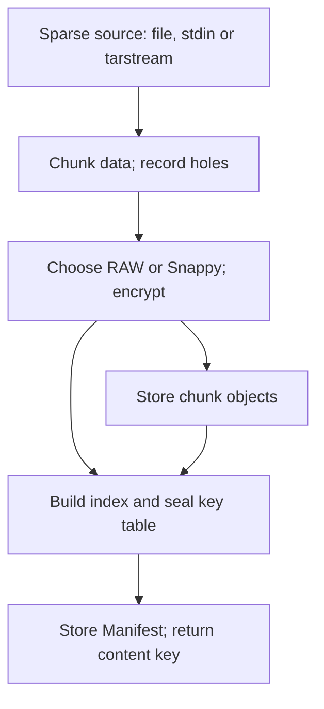

[English](manifest.md) | [简体中文](manifest_zh.md)

<a id="manifest--内容寻址存储的统一出入口"></a>

# manifest — the interface to content-addressed storage

`manifest-ctl` is the entry and exit point for content-addressed data. Image, memory-snapshot, disk and user-file bytes can be ingested through the sparse-source API; the CLI `store` command specifically accepts a **tarstream artifact**, not an arbitrary raw file. Ingest produces a **Manifest**: a compact binary object containing chunk metadata and a sealed table of chunk keys. Its content key is the handle for later `load` operations and `manifest://<key>` references. Local Manifest Bundles provide another carrier for the same objects (§4.10).

<a id="1-概述"></a>

## 1. Overview

<a id="11-模块定位"></a>

### 1.1 Role



The read direction reverses this flow: `load` gets the Manifest, resolves its chunk list, fetches through the configured cache or directly from store, decrypts and emits a tarstream artifact encoded according to `crypto.local`. A configured cache is the selected remote read path; this does not imply automatic direct-store retry on cache errors.

<a id="12-设计原则"></a>

### 1.2 Principles

- **Write path:** `sparse.Source → chunker → Snappy/RAW selection → encrypt → store.Put → Manifest`. Hole runs are recorded without reading them. Zero runs synthesize zero bytes for chunking without fetching a payload.
- **Read path:** `Manifest → fetch → decrypt → io.Writer`.
- **Deduplication unit:** a variable-length FastCDC chunk or a fixed-size chunk.
- **Deduplication domains:** salt separates convergent-key domains. Chunk payloads are stored as ciphertext; the Manifest's index/geometry and sealed key-table container are not wholly encrypted. Salt separation and encryption do not implement tenant authorization (§4.4–4.5).

<a id="13-不做什么"></a>

### 1.3 Non-goals

- Managing backend bytes directly: this belongs to [store](store.md).
- Maintaining a cache: this belongs to [cache](cache.md).
- Understanding Docker, OCI, EROFS or other high-level payload formats: the data layer handles bytes and sparse geometry.
- Implementing ACLs: the caller/deployment protects customer keys, endpoints and references.

<a id="2-命令行接口"></a>

## 2. Command-line interface

<a id="21-公共-flag"></a>

### 2.1 Shared flag

```text
Shared flag on subcommands that accept configuration:
  --manifest-config string    Manifest YAML path; overrides MANIFEST_CONFIG
```

Commands that use configuration require either `--manifest-config` or `MANIFEST_CONFIG` to name a valid YAML file. **Exceptions:** `config generate`, local-file/stdin `info`, and local-file `diff` do not need a configuration file. See §3.1 for the schema. The flag belongs after the subcommand, not before it.

<a id="22-子命令一览"></a>

### 2.2 Subcommands

| Command | Purpose |
|---|---|
| `store` | Ingest data, upload the resulting Manifest, and return its hex content key. |
| `load` | Read the plaintext logical data selected by a Manifest key, wrapped in a tarstream artifact. |
| `get-manifest` | Fetch raw Manifest bytes by hex key, chiefly for inspection. |
| `info` | Print Manifest metadata without unsealing its key table. |
| `verify` | Verify the stored Manifest and all nonzero chunks through the fetch path. |
| `diff` | Compare chunk overlap between two local Manifest files. |
| `config show` | Print parsed configuration as YAML. |
| `config generate` | Print a commented configuration template. |

Data sources and Manifest keys are **positional arguments**. Omitting the `store` input or the `info` source, or passing `-`, selects stdin. `load`, `get-manifest` and `verify` accept either a bare 64-character lowercase hex key or `manifest://<key>`. **Remote `info` requires the `manifest://` prefix**; a bare hex argument there is treated as a local filename. Put flags before positional arguments: Go's standard `flag` parser stops at the first non-flag argument.

`pkg/manifest` also exposes a canonical reference parser. A `manifest://` reference contains exactly one 64-character lowercase hexadecimal content key. Compose layers using an explicit reference array and `fetch.NewLayered`; `manifest://k1:k2` is not supported.

File references have this form:

```text
file://<path>[@digest:<digest>|@hmac:<digest>|@manifest:<key>][@location:<name>]
```

The three identity qualifiers are mutually exclusive. `@manifest` selects a root Manifest in a Manifest Bundle and must be rejected by a tarstream opener; a Bundle opener must reject `@digest` and `@hmac`. With a location, the path must be a basename. The location must match `[A-Za-z0-9][A-Za-z0-9._-]*` and carries a logical name, not a host directory. A leading digit is allowed so UUIDv7 sandbox/build IDs can be used directly.

<a id="23-manifest-ctl-store--数据写入"></a>

### 2.3 `manifest-ctl store` — ingest

```text
manifest-ctl store [flags] <path|->        # omitted input or "-" means stdin

Flags:
  --extra-salt string         Extra salt bytes mixed into the store's opaque salt
  --no-progress              Suppress live progress
```

The input is a **tarstream artifact**, the platform container for images and snapshots. Its envelope carries size and holes. Files and stdin use the same one-pass, fully validating `SourceFrom` path, without an intermediate materialization. Holes come from envelope metadata, never filesystem probing or zero-content scanning. `crypto.local=off|auto|required` respectively accepts plaintext only, plaintext or encrypted carriers, and encrypted carriers only. Before publishing the Manifest, ingest must finish validation of the inner digest, marker, trailer and outer EOF.

Stdout contains one 64-character hex line: the uploaded Manifest content key. Stderr contains live progress and a human-readable final summary. **`--no-progress` suppresses live progress, not the final summary.** An illustrative summary is:

```text
image size:   10.0 GiB
stored bytes: 1.0 GiB
chunks:       stored=2048 dedup=18432 zero=0
compression:  raw=512 snappy=19968 logical=10.0 GiB encoded=2.1 GiB saved=7.9 GiB
manifest:     encoding=raw logical=1.8 MiB stored=1.8 MiB
manifest key: a1b2c3d4...
```

Examples assume a valid configuration and customer key. `disk.img` and `snap.bin` below are already tarstream artifacts, despite their filenames; abbreviated keys elsewhere in this guide are placeholders for complete keys.

```bash
# Artifact file → Manifest key
MKEY=$(manifest-ctl store disk.img)

# Artifact stdin → Manifest key
cat disk.img | manifest-ctl store > disk.key

# Docker archive → flatten → ingest; upload-only stdout is the Manifest key
docker save myapp:v1 | flatten-ctl export --upload > app.key

# Extra salt narrows the deduplication domain; flags precede the input
manifest-ctl store --extra-salt "tenant-xyz" snap.bin

# Change chunking or crypto policy through YAML
```

<a id="24-manifest-ctl-load--数据读取"></a>

### 2.4 `manifest-ctl load` — read data

```text
manifest-ctl load [flags] <hex|manifest://hex>

Args:
  <hex|manifest://hex>        Required Manifest content key
Flags:
  --output string            Output path (default "-", stdout; refuses a terminal)
  --name string              Payload tar entry name (default "image")
  --offset uint              Start of the logical window
  --length uint              Window length (0 = the remaining bytes)
  --no-progress              Suppress live progress
```

The output is a **tarstream artifact**. Manifest holes pass losslessly into its envelope map, so there is no choice between filling and preserving holes; the old `--hole` flag was removed. The writer synthesizes IsZero chunks locally without fetching them. `crypto.local=off` emits the compatible plaintext format; `auto|required` emit encrypted v1. Use `flatten-ctl tar extract` to obtain raw payload bytes.

```bash
# Reconstruct the full artifact; flags precede the key
manifest-ctl load --output disk.img a1b2c3d4...

# A window is also emitted as a valid artifact
manifest-ctl load --offset 4096 --length 65536 --output slice.img a1b2c3d4...

# The manifest:// prefix is also accepted
manifest-ctl load --output disk.img manifest://a1b2c3d4...
```

<a id="25-manifest-ctl-get-manifest--取回-manifest-字节"></a>

### 2.5 `manifest-ctl get-manifest` — retrieve Manifest bytes

Fetch the raw Manifest object, mainly for debugging or offline `info`/`diff`. Retrieval follows the configured cache/store path.

```text
manifest-ctl get-manifest [--output -|FILE] <hex|manifest://hex>
```

```bash
# Inspect fetched bytes; alternatively use info manifest://<hex>
manifest-ctl get-manifest a1b2c3d4... | manifest-ctl info -

# Save the physical Manifest verbatim
manifest-ctl get-manifest --output disk.manifest a1b2c3d4...
```

### 2.6 `manifest-ctl info`

Read and summarize a Manifest from one of three sources: a local path, stdin (`-` or omitted), or `manifest://<hex>` through the configured remote reader. Local/stdin inspection needs neither a configuration, customer key nor store connection. Remote metadata retrieval needs configuration and connectivity but does not unseal the customer-key-protected key table.

```text
manifest-ctl info [--manifest-config <path>] <file|-|manifest://hex>
```

Illustrative output:

```text
version:       1
image size:    10.0 GiB (10737418240 bytes)
chunk mode:    cdc
chunk count:   20480
zero chunks:   0 (0 B)
holes:         0 (0 B)
min chunk:     128.0 KiB    (configured)
max chunk:     1.0 MiB    (configured)
avg chunk:     512.0 KiB

size distribution (data chunks):
       min(N)          P1          P5         P25         P50         P75         P95         P99      max(N)
  63.5K(1)       128.0K      256.0K      384.0K      512.0K      640.0K      896.0K        1.0M     1.0M(412)
  (max == configured max — 412/20480 (2.0%) chunks are forced CDC cuts)
key table:     655389 bytes (sealed)
manifest size: 1802334 bytes
```

The minimum/maximum marked `(configured)` are the bounds stored in the Manifest header, not measured extremes. The percentile distribution below covers nonzero data chunks. Parentheses in `min(N)`/`max(N)` count chunks at each observed extreme. The final diagnostic appears only when the measured maximum equals the configured cap, identifying forced-size CDC cuts.

`manifest-ctl info manifest://<hex>` is the direct equivalent of `get-manifest … | info -` for remote inspection.

### 2.7 `manifest-ctl verify`

Fetch and decrypt every nonzero chunk to verify the entire Manifest's availability and content. This command forces physical SHA-256 checking even if ordinary reads disable it.

```text
manifest-ctl verify [--no-progress] a1b2c3d4...        # or manifest://a1b2c3d4...
```

```text
verified: 20480  skipped(zero): 0  holes: 0  failed: 0  total chunks: 20480
```

<a id="28-manifest-ctl-diff--去重率分析"></a>

### 2.8 `manifest-ctl diff` — deduplication analysis

```text
manifest-ctl diff <manifest-a> <manifest-b>
```

Both arguments are local Manifest files, which can be obtained with `get-manifest`. `diff` neither opens a store nor loads a configuration or customer key.

```text
manifest A:  10.0 GiB, 20480 chunks (20480 unique)
manifest B:  10.1 GiB, 20512 chunks (20512 unique)
shared:      18432 chunks (9.0 GiB)
only in A:   2048 chunks (1.0 GiB)
only in B:   2080 chunks (1.1 GiB)
dedup ratio: 45.0%
```

### 2.9 `manifest-ctl config`

```text
manifest-ctl config show     [--manifest-config <path>]
manifest-ctl config generate
```

`generate` prints a commented template. `show` prints the loaded configuration as YAML; it does not prove that all backend connections and deferred constructors will succeed.

<a id="3-配置"></a>

## 3. Configuration

### 3.1 manifest-config.yaml

```yaml
manifest:
  key: "0a1b2c3d..."              # Placeholder: a 32-byte hex customer key seals the key table
  verify_content: true           # Recheck physical Manifest/Chunk SHA-256; default true
  # write_generation: G3         # Optional write generation
store:
  endpoint: 127.0.0.1:7100        # Required for remote writes/direct-store reads; optional for offline Bundles
                                 # TCP host:port or UDS (/run/sandbox/store.sock or unix:///...)
  pool: 4                        # Independent grpc.ClientConn instances, round-robin
  timeout: 5s                    # Per-store-RPC timeout
cache:
  endpoint: 127.0.0.1:7070        # Empty selects direct store; otherwise use cache wire; UDS also accepted
  pool: 4
  timeout: 2s
chunker:
  mode: cdc                      # cdc | fixed
  cdc:
    min: 128KiB
    avg: 512KiB
    max: 1MiB
  fixed:
    size: 512KiB
crypto:
  chunk: aes                     # Only supported value
  manifest: aes                  # Only supported value
  local: off                     # off | auto | required; default off
```

Fields:

- `manifest.key` is the customer key that **seals the Manifest's key table**; it does not derive the chunk encryption key. Losing it prevents unsealing that Manifest's table. It may be omitted from YAML and supplied through **nonempty `MANIFEST_KEY`**, the primary delivery mechanism. A nonempty environment value overrides YAML; an empty one falls back to YAML. The key is resolved lazily and not written back into Config, so `config show` does not echo the environment-provided key. **A key explicitly stored in YAML remains in Config and can be printed by `show`.** If both sources are empty, operations needing the key fail.
- `manifest.verify_content` defaults to `true`. Ordinary Bundle/cache/store Fetchers, `GetManifestBlob` and `CheckManifest` share the policy. When enabled, they check `SHA256(physical Manifest) == requested key` before parsing and `SHA256(physical Chunk) == CiphertextHash` when first reading a chunk. When disabled, ContentKey is a locator and those complete-object hash scans are skipped. The process emits one clear warning. Envelope/geometry checks, key-table GCM authentication, chunk format/length validation, decryption and decompression remain. Chunk AES-CTR itself is not authenticated encryption; disabling the physical hash check removes that chunk-content integrity check. `manifest-ctl verify`, full Bundle verify/upload/export and object repair always force SHA verification.
- `manifest.write_generation` optionally selects a write generation. With `store.endpoint`, empty means `AdmitWrite()` selects the latest admitted generation; a value uses `AdmitWriteFor(generation)` and fails if it was removed. A Store RPC failure does not fall back to local derivation. An offline Bundle writer without Store uses the ordinary generation name `NONE` when unset, or the explicit value otherwise; both derive salt with public `store.SaltForGeneration`. `NONE` is neither reserved nor a special protocol value.
- `store.endpoint` points at the store-ctl gRPC service for remote object I/O. It accepts TCP `host:port` or a Unix socket. Bare `/run/sandbox/store.sock` is normalized to `unix:///run/sandbox/store.sock`; an explicit `unix:` target is passed through. Match store-ctl's `listen` address. Same-host UDS avoids TCP transport; local Bundle object I/O follows the separate Bundle reader/writer contract.
- `cache.endpoint`: empty selects direct-store reads; nonempty selects cache-ctl's wire protocol. It accepts `host:port`, explicit Unix targets or a bare socket path, matching cache-ctl's `listen`. This is source selection at construction, not error-triggered failover around a configured cache.
- `chunker.mode` is `cdc` (FastCDC) or `fixed`; see §4.1.
- `crypto.chunk` and `crypto.manifest` each accept only `aes`; other values fail when the crypto objects are constructed (§4.3–4.4).
- `crypto.local` is a local-format compatibility/enforcement policy, not an algorithm selector. `off` does not enable the local codec; `auto` reads legacy plaintext or encrypted carriers; `required` accepts only encrypted carriers. The default is `off`.

<a id="32-加载顺序"></a>

### 3.2 Loading order

The **configuration filename** comes only from the CLI flag or its environment variable; there is **no automatic discovery**:

| Source | Precedence |
|---|---|
| `--manifest-config FILE` | First, when nonempty. |
| `MANIFEST_CONFIG` | Used when the flag is empty. |
| Neither | Error for commands that need configuration; §2.1 lists the exceptions. |

The **customer key** has a separate precedence rule: nonempty `MANIFEST_KEY` overrides `manifest.key` from YAML. Thus a shared config file can omit the key while the command receives it separately.

`pkg/manifest.ParseConfig` also accepts **in-memory YAML bytes**, for example configuration delivered to sandbox-ctl over a config socket. Endpoint and crypto settings need not be written to disk. A caller may set the key separately in `Config.Manifest.Key`; the environment override still applies when `CustomerKey()` is used.

There are no per-field command-line overrides for chunker or crypto settings. Change the YAML to change those settings.

<a id="4-设计"></a>

## 4. Design

### 4.1 Chunking

Chunking divides the logical byte stream into deduplicable units. Two modes are available.

#### FastCDC (cdc)

Variable-length, content-defined chunking selects boundaries using a rolling hash and Gear table.

| Parameter | Default | Meaning |
|---|---|---|
| `min` | 128 KiB | Minimum cut length; the final fragment of a data segment may be shorter. |
| `avg` | 512 KiB | Target average length used to derive the Gear masks. |
| `max` | 1 MiB | Maximum length; reaching it forces a cut. |

These sizes and fixed `size` must be multiples of 4 KiB. The chunker constructor validates them; merely parsing YAML is not equivalent to constructing a valid chunker. The Manifest ingester also enforces the canonical 64 MiB maximum decoded chunk size.

Content-defined boundaries can regain alignment after insertions/deletions and retain deduplication beyond the changed area. This implementation aligns cuts to 4 KiB boundaries; the amount of boundary disturbance depends on the edit, alignment, sparse segmentation and content. It does not guarantee that any arbitrary byte insertion changes only a fixed small number of chunks.

#### Fixed-size (fixed)

Fixed-size chunks default to 512 KiB. The layout is simple and predictable, but insertions/deletions that shift later fixed boundaries can substantially reduce deduplication. This is useful as a performance baseline and for predictable layouts; CDC is the default for content reuse. Relative speed and hit rate depend on the workload.

Change YAML `chunker.mode` to select the mode; the command-line interface is unchanged.

<a id="42-收敛加密convergent-encryption"></a>

### 4.2 Convergent encryption

The invariant is **same plaintext + same salt → same ciphertext**, allowing objects within a shared deduplication domain to reuse stored chunk bytes. Chunk payloads are encrypted; this is not a claim that every Manifest field is secret or that a store cannot infer repeated content.

<a id="key-派生"></a>

#### Key derivation

```text
salt = server_salt (+ extra_salt mixing)   # §4.5
key  = SHA256(salt || plaintext)          # convergent key
```

AES-CTR uses an all-zero IV. The key is derived from the **original plaintext**, while the fixed canonical encoder selects one RAW or Snappy payload for that plaintext. Thus the supported canonical writer does not encrypt two different encoded payloads with the same derived key/IV pair. Under the hash assumptions, identical plaintext in one salt domain produces the same physical object, the same `ContentKey = SHA256(object)`, and one stored byte sequence.

This requires the Go Snappy version, `snappy.Encode`, benefit threshold and format rules to stay fixed. The current reader rejects the older development layout. Do not mix incompatible writers within a salt/key domain. A future change to encoder output or thresholds requires domain separation and an explicitly reviewed migration; changing the format byte alone is insufficient. Verify the selected release's reader/writer compatibility and preserve existing assets and rollback data rather than treating an old “not yet released” note as permission to delete a live salt domain.

The canonical encoder is the block API in **`github.com/golang/snappy` v1.0.0**. Golden tests constrain identical encoded bytes across amd64, amd64 `noasm` and arm64. Byte-for-byte consistency takes precedence over a higher compression ratio. The standard and Snappy-compatible `klauspost/compress/s2` encoders can produce different block bytes across architecture implementations, so they are not used for canonical writes.

#### Content key

Chunks use `SHA256(physical_object)` as the store key; Manifests use `SHA256(physical_envelope)`. Salt is not separately concatenated into the address calculation. It changes encrypted object bytes, which changes their physical hash. Store can therefore expose one content-key KV view while preserving distinct encrypted objects for different salt domains. See [store](store.md).

<a id="43-加密模式--chunk"></a>

### 4.3 Chunk encryption format

YAML `crypto.chunk` accepts only `aes`; all other values fail at construction, with no plaintext fallback.

Every nonzero chunk is encoded as a Go Snappy block candidate. Snappy is selected only if both canonical conditions hold; these are not configuration options:

```text
saved = rawSize - encodedSize
Snappy iff saved >= 4 KiB AND encodedSize * 4 <= rawSize * 3
```

The implementation evaluates this rule without overflowing adversarial integer lengths.

| Format byte | Payload | Physical object |
|---|---|---|
| `0x01` (`AESRaw`) | Original plaintext. | `[0x01] || AES-256-CTR(key, IV=0, plaintext)` |
| `0x02` (`AESSnappy`) | `snappy.Encode(plaintext)`. | `[0x02] || AES-256-CTR(key, IV=0, snappy_block)` |

The encryption layer derives `SHA256(salt || plaintext)` internally; its caller passes salt, not a chunk key. Distinct plaintexts receive distinct keys under the hash assumptions, avoiding intentional CTR keystream reuse within the canonical contract. The format byte is cleartext but included in the physical ContentKey.

The Manifest entry records the original plaintext size and the complete physical hash; it does not add a codec field. Unknown formats, inconsistent lengths, truncation, invalid Snappy blocks and Snappy objects that violate the fixed benefit threshold fail. There is no format guessing or fallback. With physical SHA verification enabled, changed object bytes fail hash validation; AES-CTR and structural checks alone do not authenticate all possible plaintext corruption when that verification is disabled.

<a id="44-加密模式--manifest"></a>

### 4.4 Manifest encryption format

The Manifest's **key table** encodes all nonzero chunks' encryption keys.

| Mode | Behavior |
|---|---|
| `aes` | AES-GCM seals the key table with `manifest.key` and Manifest AAD; the customer key is required to unseal it. |

This protects the key table, not the entire Manifest index. A store holding only the objects does not obtain the customer key from them. However, the chunk key is derived from salt and plaintext independently of that customer key. An actor with the relevant salt and a plausible plaintext guess can derive a candidate chunk key and test the corresponding object. Same-domain deduplication also reveals equality. Therefore “the customer key never leaks” alone is not a universal guarantee that stored chunk contents cannot be inferred. Protect key/salt access, references and service authorization according to the deployment's trust boundary.

<a id="45-salt-与-dedup-域"></a>

### 4.5 Salt and deduplication domains

Different salts derive different chunk keys from the same plaintext, yielding different ciphertext, physical ContentKeys and stored objects.

The effective salt combines:

- **`server_salt`:** each ingest obtains one write admission from store, carrying a generation and opaque salt. Default writes call `AdmitWrite()`; an explicit write generation uses `AdmitWriteFor`. All chunks and the final Manifest reuse the admission. A generation change affects newly admitted ingests, not already admitted work.
- **`extra_salt`:** optional bytes from `--extra-salt` (§2.3), mixed into the admitted salt.

```text
final_salt = server_salt                                                   # empty extra_salt
final_salt = SHA256("accelerator-extra-salt-v1" || server_salt || extra_salt) # nonempty extra_salt
```

`extra_salt` creates a narrower deduplication domain within one store generation, for example per tenant. This is domain separation, not an ACL.

<a id="46-manifest-二进制格式"></a>

### 4.6 Manifest binary format

The current Version1 **physical envelope** is:

```text
[4 bytes "MANI"][1 byte encoding][payload]

encoding 0x00 (RAW): payload = logical manifest bytes after magic
encoding 0x01 (Snappy): payload = snappy.Encode(logical manifest bytes after magic)
```

RAW/Snappy uses the same fixed minimum-4-KiB-saving and maximum-75%-encoded-size threshold as chunks. The reader does not accept the old `[MANI][Version1]...` physical representation.

Before Snappy allocation/decode, the reader calls `snappy.DecodedLen`. The complete logical Manifest, including magic, is limited to **64 MiB**. Encoded length, table offsets/lengths and integer additions are bounds checked. A Snappy envelope violating the benefit threshold is rejected. RAW parses directly from the envelope payload without copying a complete Manifest to rebuild the old layout; Snappy retains one bounded decoded buffer.

The logical layout uses little-endian integers; magic itself is the byte string `MANI`.

| Region | Layout |
|---|---|
| Header, 64 B | `magic[4]`, `version u8`, `chunk_mode u8`, reserved padding; `image_size u64`, `chunk_count u32`, configured `chunk_min/max u32 × 2`; key-table offset/length, hole count and hole-table offset; reserved bytes to 64 B. Chunk mode 1 = CDC, 2 = fixed. |
| Chunk index, 56 B per entry | `image_offset u64`, `plain_len u32`, `flags u32` (bit 0 = zero chunk), `cipher_hash[32]`, **8 reserved zero bytes**. Entries are sorted by image offset. |
| Holes, 16 B per extent | `offset u64`, `size u64`. Data entries and holes exactly tile `[0, image_size)`. |
| Key table | Customer-key-sealed AES-GCM table of nonzero chunk keys: `key_0[32], key_1[32], ...`. |

All-zero chunks (flag bit 0) are neither encrypted nor stored and have no key-table entry; reads synthesize zero bytes locally. A Hole is an externally declared absence of data, distinct from an all-zero data chunk. Data chunks and holes cover the image without overlaps or gaps.

For ordinary reads with `manifest.verify_content=true`, the physical envelope hash is checked against the requested Manifest key before parsing. The reader parses the header/index, finds the requested chunk by binary search, unseals the key table, fetches the chunk by `cipher_hash` through cache/store, decrypts and writes the logical bytes. Disabling ordinary verification changes the hash-check step as described in §3.1; explicit verify paths always force it.

<a id="47-写路径细节"></a>

### 4.7 Write path in detail

The stages below describe one logical chunk; encryption and upload run concurrently across chunks as explained afterward.

| Stage | Operation |
|---|---|
| Sparse input | Record and skip Hole runs; synthesize Zero runs without fetching data. |
| Chunking | Split contiguous non-hole segments using CDC or fixed mode. |
| Key derivation | `key = SHA256(salt || original_plaintext)`. |
| Encoding | Compute a Go Snappy candidate and select RAW/Snappy by the fixed rule. |
| Encryption | AES-CTR plus the format byte produces a physical object and its SHA-256. |
| Address | Reuse the crypto layer's returned physical hash as ContentKey; ingest does not hash it again. |
| Chunk upload | `store-ctl Put(admission, partition=chunk, key=ContentKey, size, ciphertext)`. The server checks existence first; a dedup hit can finish without uploading the body. Otherwise the fs backend writes under `chunk/{generation}/aa/bb/<hash>`; other backends follow their own storage layout. |
| Metadata | Append chunk metadata and its key in logical order. |
| Seal | Seal the key table with the customer key and Manifest AAD. |
| Envelope | Encode logical Manifest bytes as the canonical RAW/Snappy physical envelope. |
| Publication | Put the Manifest under the **same admission**, in the Manifest partition. |

The derive/encode/encrypt/Put work uses a **bounded worker pool**, with worker count obtained from the store writer's `PoolSize()` capability. The standard store client's pool is configured by `store.pool`; a writer that does not expose this capability uses one worker. This is an ingest implementation limit, not a claim that one gRPC connection can have only one RPC in flight.

Chunking remains sequential, the index is assembled in source order and progress callbacks are serialized. Out-of-order upload completion does not reorder the Manifest. Reproducible Manifest bytes additionally require the same sparse input, chunker/codec settings, salt/admission and customer-key/AAD inputs; concurrency alone does not establish cross-configuration determinism. Bounded parallel upload can overlap backend round trips for multi-GiB snapshots. The [project performance guide](https://github.com/kuasar-sandbox/kuasar-sandbox/blob/main/docs/perf.md) describes measurement; no throughput improvement is guaranteed without a recorded workload and run.

<a id="48-读路径细节"></a>

### 4.8 Read path in detail

| Interface/stage | Responsibility |
|---|---|
| Manifest key | An on-demand Getter fetches the Manifest partition object. |
| Metadata | Parse the index and unseal the key table. |
| Stream | One Manifest creates one Stream; callers use `NewLayered` for explicit top-to-bottom layer arrays. |
| `RunAt` | Resolve an executable sparse Run (Hole, Zero or Data). Manifest Data additionally implements `fetch.ChunkRun`. |
| `ResolveChunkWindow` | Optionally expand one physical chunk within the final visible view. |
| `Run.ReadAt` | Read one already-resolved visible run. |
| `Stream.ReadAt` | Collect runs, then fetch visible Data concurrently through the on-demand Getter, verify/decrypt and use the bounded plaintext chunk cache. |
| Optional `Prefetcher.Prefetch` | Use the prefetch Getter to warm cache/store objects, then Release immediately. |

`Stream.RunAt` returns an immutable `sparse.Run` spanning `[Offset(), End())`. `Run.ReadAt` takes an offset relative to `Offset()` and rejects reads across `End()`. `RunAt` consults only sparse maps, the Manifest index or tar extent metadata. It does not read payloads, invoke cache/store Get, verify/decrypt bytes, or advance a one-shot source. Manifest Data Runs retain the initially resolved chunk index and implement `fetch.ChunkRun`; Hole, Zero and tar/file Data Runs implement only the ordinary sparse Run interface.

`fetch.ResolveChunkWindow(stream, anchor, maxBytes)` offers optional bidirectional metadata resolution for callers that want to reuse one physical-chunk read. The anchor must come from `RunAt` on that same final composed stream. If the physical chunk fits `maxBytes`, the helper returns the largest contiguous final-visible window containing the anchor and served by that chunk. An upper Hole is transparent; upper Data and Zero are hard boundaries, as is the root Stream's `Size()`. Portions of a lower chunk separated by opaque upper content are never merged across that content.

Resolution does not call a payload Getter, verify, decrypt or decompress. An over-limit chunk or a package ChunkRun whose physical identity cannot be resolved retains the original anchor, so the caller can continue using forward-only semantics.

`Stream.ReadAt` first collects all runs covering the requested window, before modifying the destination buffer. It then concurrently calls `Run.ReadAt` only for Data; Hole and Zero fill with zeros. Layered Streams apply top-to-bottom visibility: Data and Zero hide lower layers; only Hole or being beyond a layer's size permits fallthrough. Each upper Hole tightens the bound before returning the final child Run. Nested overlays retain ChunkRun capability, and a lower chunk cannot cross a position where any upper layer becomes visible again. A partial read (`--offset`/`--length`) fetches only physical chunks needed for that window, without scanning/materializing the whole image.

A Stream supporting prefetch also implements `fetch.Prefetcher`. `Prefetch(ctx)` traverses the complete logical Stream and invokes full-physical-chunk cache Get only for finally visible ChunkRuns implementing the package's prefetch capability. Ordinary Data, Hole and Zero are no-ops. A successful Get is immediately Released without reading the Blob, verifying, decrypting or pinning it. Prefetch operates on the current composed Stream's full visible view; there is no longer a manifest-key API for selecting a leaf to prefetch.

Within one Fetcher, Manifest metadata reads, ordinary ReadAt calls and all Streams share a Getter and request scheduler. On-demand requests never wait for an already-started prefetch. While any on-demand operation is present, no new prefetch is admitted; at most one prefetch Get is in flight per Fetcher. A started prefetch is not preempted and can briefly overlap a later on-demand operation. Different Fetchers are independent. The scheduler creates no background goroutine and does not own the underlying Getter's lifetime.

Each Manifest Stream has an independent decrypted-chunk cache for on-demand partial reads. Its key includes `CiphertextHash`, the chunk decryption key and plaintext size: repeated physical content within that Stream can be reused without aliasing different keys or logical sizes. Both **32 entries** and **32 MiB** are hard cache-admission limits, with LRU eviction. An entry expires after **5 seconds** idle since its last hit. Each Stream keeps one timer for the earliest expiry, actively reclaiming stale data even when reads stop, without one timer per entry or a resident scanning goroutine.

Concurrent misses for one cache key coalesce into one Get, SHA verification, decryption and optional Snappy decode; different keys can load concurrently. Failed loads are not cached. Waiters with a still-valid context may retry rather than permanently inheriting the first loader's cancellation. A partial miss allocates one plaintext-sized cache buffer and writes directly into it while the immutable Blob remains alive; ciphertext is neither copied nor modified. Eviction, expiry and `Close()` clear plaintext. An entry currently being copied is removed from the LRU first and cleared after its last reader releases it.

A cold, full-physical-chunk read uses a direct path so a one-off sequential scan does not pollute the cache; an existing cache hit may still serve a full read. Plaintext chunks larger than 32 MiB also bypass cache admission. RAW full reads decrypt AES directly into the caller's buffer, without an extra plaintext allocation or full-chunk copy. Oversized RAW partial reads seek the CTR block/offset and decrypt only the requested range.

For Snappy full reads, encrypted payload is decrypted into bounded encoded scratch, `DecodedLen == entry.Size` is checked, then decode writes into the caller's buffer. Oversized Snappy partial reads must decode the whole block into bounded temporary plaintext and copy the requested range because the block format does not support arbitrary-range decode.

Snappy scratch uses explicit size-class free lists, not a `sync.Pool` with no retained-byte ceiling. Encode and decode have separate `max(1, GOMAXPROCS)` CPU-slot limits, **192 MiB active-byte budgets** and **64 MiB retained budgets**, totaling at most 256 MiB of codec-owned scratch per direction. The largest normally retained buffer is 2 MiB; larger buffers are discarded after use. Slot and weighted-byte admission honor caller cancellation. RAW reads do not take a decode slot. There is no background goroutine for scratch management.

Prefetch still performs only full physical-object cache Get and immediate Release. It neither verifies/decrypts nor populates the plaintext cache. Thus prefetch and on-demand ReadAt may each issue a Get, while repeated on-demand partial reads are coalesced and reused inside the Stream.

<a id="49-本地-immutable-tarstream-加密"></a>

### 4.9 Local immutable tarstream encryption

A canonical plaintext tarstream contains the payload, a `.kuasar.digest.<plainDigest>` marker body and exactly two trailer blocks. Payload PAX records define its boundary; the marker body records that boundary and the payload commitment. Full reads recompute the commitment from payload bytes.

A complete carrier, or a derived source replacing only its dense metadata tail, can report identity through `CarrierDigest` without first encoding the payload into `io.Discard`. Without a codec, the public identity is `digest:<plainDigest>`. A derived dense metadata tail is limited to **64 MiB**; readers and writers share this limit and reject oversized declarations before hashing. Payload PAX/ustar transport metadata, including mode, ownership and timestamps, uses fixed canonical encoding and cannot change while retaining the same identity.

With a customer-key-backed codec, the complete structure is encoded as encrypted tarstream v1. Its public identity is exactly:

```text
hmac = HMAC-SHA256(customerKey, plainDigestRaw32Bytes)
```

The scheme is named `hmac`. It does not derive a separate identity key or add a domain prefix. The marker's plaintext digest and payload commitment remain inside ciphertext and must not be used in plaintext filenames, references, logs or errors. The physical carrier determines the identity scheme: `auto` returns `@digest` for a plaintext carrier and `@hmac` for an encrypted one, without implicit conversion.

V1 fixes **AES-256-GCM** and independently authenticated **4096-byte records**. It negotiates neither algorithm nor record size. The file comprises a **48-byte clear prefix**, an **81-byte authenticated header**, then authenticated records. Prefix bytes `[0:16]` hold magic, version, prefix size and reserved fields; `[16:48]` hold a fresh 32-byte artifact salt from `crypto/rand`. Once per artifact, the codec derives a key and constructs one AES-256-GCM instance:

```text
artifactKey = HMAC-SHA256(
  customerKey,
  "kuasar/tarstream/aes-gcm/artifact-key/v1\x00" || artifactSalt
)
```

The header uses sequence 0; data record `i` uses `i+1`. The 12-byte GCM nonce is `0x00000000 || uint64BE(sequence)`. Each wire record consists of a one-byte AES-GCM flag, ciphertext and a 16-byte tag: **17 bytes of overhead**, with no separately stored per-record nonce.

The header binds total plaintext size, packed-payload start/size and record geometry. Each record's AAD binds the complete prefix including salt, authenticated header, record index and actual plaintext length. Writing first sweeps sparse metadata and plans layout, then reads Data extents once; it does not create a plaintext staging/spool file.

Random artifact salt makes two writes of the same plaintext/customer key produce different physical ciphertext. The logical identity nevertheless remains exactly `HMAC-SHA256(customerKey, plainDigestRaw32Bytes)`, preserving the scheme, filename and logical deduplication key.

`SourceAt` reads prefix salt, binds the artifact codec, authenticates the header and suffix records covering marker/trailer, then decrypts records by index for O(1) random access. This fast path does not pre-read all data records or recompute the complete plaintext digest. Different artifacts use different derived keys, so a spliced donor record fails authentication **when that record is actually read**. A donor record outside the fast-open read set does not cause an early error.

`SourceFrom` is the full-validation path. Complete consumption decrypts every record, recomputes payload/tail commitments and carrier identity using the authoritative sparse map, and verifies the marker body, exactly two trailer blocks, expected `digest|hmac` and outer EOF. A cross-artifact record splice fails when sequential consumption reaches it.

If a caller stops early, no full-validation conclusion applies to unread data. Publishing, uploading and converting paths must consume all Data extents and propagate terminal validation errors.

<a id="410-多-manifest-zip-bundle"></a>

### 4.10 Multi-Manifest ZIP Bundles

Local Manifest snapshots use a standard ZIP container with ZIP64 support and a **mandatory tail index**. The current profile requires `bundle/index` directly: no legacy-format probing, unindexed compatibility or Central Directory fallback.

```text
[0]     bundle/refs                                            # optional
[0|1]   bundle/admission/<generation>/<64-lowercase-hex-salt>
[...]   chunk/<64-lowercase-hex-content-key> |
        manifest/<64-lowercase-hex-content-key>
[last]  bundle/index                                           # required

        Central Directory
        ZIP64 EOCD + locator                                   # when required
        EOCD with an empty comment
```

Manifest and Chunk payloads are the unchanged bytes of their existing physical objects. Chunk local entries are appended in the ordinal of first logical appearance in the Manifest. Only index records are sorted; the writer neither reorders Chunk payloads by ContentKey nor buffers all of them. Shared objects deduplicate by ContentKey. Manifest keys, chunk keys and physical object bytes do not change.

Every local entry uses `zip.Store`, flags 0, no data descriptor and no local extra. Comments, timestamps, permissions and platform fields are fixed. Exactly one `bundle/index` must be the final local entry; its last 256 payload bytes immediately precede the real Central Directory.

A Bundle uses no ZIP Deflate, ZIP encryption, whole-file SHA/HMAC, outer encryption, custom pack format, root entry or JSON/YAML metadata. Old `admission/*` names, old unindexed Bundles, duplicate/unknown entries, directory entries, invalid keys/admissions and truncation are rejected by the appropriate profile/verification path. Ordinary open intentionally defers some object/container checks; it is not the strict full-container verifier (§4.10.4).

#### 4.10.1 `bundle/index` v1

The index payload is **Chunk section, Manifest section, fixed footer**, in that order. Each section is strictly increasing by ContentKey; its partition is implicit in its section. Duplicate or unsorted keys are invalid. Every record is exactly 48 bytes, explicitly little-endian:

| Byte range | Field | Encoding |
|---|---|---|
| `[0,32)` | ContentKey | Raw 32 bytes. |
| `[32,40)` | Payload DataOffset | `uint64`, absolute payload offset in the archive. |
| `[40,44)` | Payload Size | `uint32`. |
| `[44,48)` | ZIP CRC32 | `uint32`. |

DataOffset is **not** a Local Header offset. `DataOffset + Size` must use checked addition and lie entirely after the metadata prefix and before the `bundle/index` Local Header. Individual Manifest/Chunk sizes remain subject to their codec limits.

The ZIP is limited to **100,000 entries**. The two index sections together allow at most **99,998 object records**, and the index payload is bounded by **4,800,160 bytes**. Both limits apply; an optional refs entry also consumes a ZIP entry.

The footer is exactly 256 bytes. Integers are little-endian; magic and digests are raw bytes.

| Byte range | Field |
|---|---|
| `[0,16)` | Magic `KUASARBNDLINDEX1`. |
| `[16,18)` | Version, fixed at `1`. |
| `[18,20)` | Footer size, fixed at `256`. |
| `[20,22)` | Record size, fixed at `48`. |
| `[22,24)` | Reserved, all zero. |
| `[24,32)` | Absolute index-payload offset. |
| `[32,40)` | Total index-payload size. |
| `[40,48)` | Absolute `bundle/index` Local Header offset. |
| `[48,56)` | Metadata-prefix end offset. |
| `[56,64)` | Absolute Manifest-section offset. |
| `[64,72)` | Manifest record count. |
| `[72,80)` | Manifest-section size. |
| `[80,112)` | SHA-256 of exact encoded Manifest-section bytes. |
| `[112,120)` | Absolute Chunk-section offset. |
| `[120,128)` | Chunk record count. |
| `[128,136)` | Chunk-section size. |
| `[136,168)` | SHA-256 of exact encoded Chunk-section bytes. |
| `[168,252)` | Reserved, all zero. |
| `[252,256)` | CRC32C/Castagnoli of footer bytes `[0,252)`. |

Each section's size must equal exactly `count * 48`. The Chunk section starts at the index-payload beginning; the Manifest section follows immediately, followed immediately by the footer. They may neither overlap, leave gaps nor cover footer bytes.

If `directoryOffset` is the real Central Directory start declared by EOCD/ZIP64 EOCD, both equalities must hold:

```text
indexPayloadOffset + indexPayloadSize == directoryOffset
footerOffset + 256 == directoryOffset
```

Section SHA-256 and footer CRC32C detect index corruption; they are not signatures or authentication. Object-content protection follows the Manifest ContentKey, sealed key-table/decryption contract and `manifest.verify_content` policy. Chunk AES-CTR must not be described as authenticated encryption by itself.

The writer does not depend on `archive/zip.Writer`'s internal flush position. It maintains a logical `nextOffset` from canonical Local Header layout: `dataOffset = nextOffset + 30 + len(name)`. Finalize first checks the root Manifest, then sorts/encodes Chunk and Manifest records, writes the final `bundle/index`, and lets the standard ZIP writer emit Central Directory/ZIP64/EOCD. Strict verification and tests cross-check each record's offset, size and CRC against actual CD/LFH/data ranges.

<a id="4102-metadata-prefix-与-reader-io"></a>

#### 4.10.2 Metadata prefix and Reader I/O

If present, `bundle/refs` must be nonempty and the first physical Local File Header. Admission follows immediately. Without refs, admission is first. The admission payload is empty.

Refs are canonical Bundle file references searched in file order, one per line:

```text
file://<basename>.bundle
file://<basename>.bundle@location:<name>
```

Refs prohibit `@manifest`, `@digest`, `@hmac`, `manifest://`, absolute paths, directory separators and filenames lacking the `.bundle` suffix. The payload must be valid UTF-8 using LF only, including a final LF. BOM, CR, empty lines, comments, surrounding whitespace and duplicate references are forbidden.

The writer preserves caller order without sorting. The limits are **1024 refs** and **1 MiB**. An empty list is represented by omitting the entry. `WriterOptions.Refs` is validated before `NewWriter` writes any byte. Refs and admission are immutable after construction; `Reader.Refs()` returns a copy.

A preflight needing only location/admission may use `OpenMetadata`/`ReadMetadata`. It validates only the contiguous Local Header metadata prefix, without reading the tail, index, Central Directory or objects. Successful prefix parsing proves neither that the Bundle is consumable nor that unindexed Bundles are supported. Actual Manifest/Chunk consumption requires `Open`/`NewReader`, which require a valid v1 index.

Ordinary `Open`/`NewReader` neither invokes `archive/zip.NewReader` nor reads Central Directory bytes, object Local Headers, the Chunk index or object payload. The remote ReaderAt opening sequence is fixed:

1. Read EOCD from EOF. For ZIP64, also read the locator and ZIP64 EOCD once each, obtaining the real directoryOffset without reading the CD bytes at that offset.
2. Read the footer at `directoryOffset - 256`; verify magic, version, checksum and all section bounds.
3. Read and verify the index entry's own canonical Local Header.
4. Read the metadata prefix contiguously using `metadataPrefixEnd`, then parse refs/admission in memory.
5. Read the complete Manifest section once, validate its digest, sort order, uniqueness, sizes and ranges, and build an O(1) read-only lookup map. Leave the Chunk section unread.

Thus the specified ZIP32 ReaderAt open uses **five fixed range reads**; ZIP64 uses **seven**. The count does not grow with Chunk count. Local file opening prefers read-only mmap. The ReaderAt object-payload fallback uses a bounded per-Reader buffer pool with 4 KiB–2 MiB size classes and at most **32 MiB retained**.

<a id="4103-source-selectionchunk-preparation-与普通-restore"></a>

#### 4.10.3 Source selection, Chunk preparation and ordinary restore

A Bundle can hold the root memory Manifest, current root/data-disk layer Manifests and, when needed, incorporated parent-layer Manifests. All objects share the complete `store.WriteAdmission` recorded in the admission entry. The caller obtains one admission before constructing `bundle.Writer`; subsequent Ingest calls read that fixed value. Shared chunks are written once per ContentKey.

Chunk encoding can run concurrently, but bounded ordinal reordering waits for logical order and appends ZIP bytes serially, avoiding an unbounded completion queue.

`Config.NewBundleIngester` connects the writer to the configured ingest path. This entry point deliberately adds **no extra salt**: chunk keys must belong to the recorded admission's canonical salt domain so exact upload can verify/copy each object without rewriting it.

The read side chooses a source **only at `Fetcher.OpenManifest`**, in this order:

```text
current Bundle → bundle/refs[0] → bundle/refs[1] → ... → default remote Cache/Store
```

A caller-supplied `bundle.SourceResolver` resolves paths and locations. Accelerator consumes canonical references already validated by the Reader. A resolver may return `ErrSourceUnavailable` for a missing sibling, missing location mapping or missing located file. Source selection has not completed yet, so diagnostics may be retained while search continues. A present file with a corrupt profile/ZIP must return an ordinary error and fail closed. A referenced Bundle's own Refs are not recursively searched; the creator must flatten the search list.

| Manifest source | Getter for its Manifest and chunks | Failure behavior |
|---|---|---|
| Current Bundle or first refs Bundle containing the key. | That Bundle only. | Chunk-index, object-read, parse or decrypt errors fail directly; no further search. |
| All Bundles cleanly miss or are unavailable. | Remote cache/store only. | Coincidentally matching chunks in other Bundles are not used. |

There is no per-object fallback Getter mixing Bundles. A corrupt local Manifest does not cause a retry from another Bundle or Store. Current/refs source selection only queries the Manifest maps loaded at Open; a clean miss does not read a Chunk section.

Once a Bundle is selected, its Reader loads the entire Chunk section contiguously **before returning a Stream**, validates its digest/records/ranges and builds an O(1) immutable map. `sync.Once` combines concurrent preparation into one read; its error or cancellation is shared by all callers. A remote source has no Bundle Reader and skips this preparation.

After preparation, Manifest/Chunk Get uses the record's payload DataOffset/Size for one target-payload range read, without rereading the index, object Local Header or Central Directory. The Stream's first data read therefore does not pay an O(Chunk-record-count) initialization cost.

An external root selector must use `OpenRootManifest`/`SelectRoot` to prove that the root physically exists in the **current Bundle**. It may not obtain the root indirectly from refs or Store.

Ordinary restore does **not** pre-scan the Manifest's complete chunk closure. A Manifest may name a missing chunk that the current workload never reads: Open/OpenManifest can succeed and present chunks remain readable. The missing chunk fails only when actually accessed, with no source fallback after selection.

`manifest.verify_content=false` does not implicitly trigger physical SHA scans. When enabled, the Manifest and Chunk physical hashes and key-table authentication are checked according to the normal read contract. Neither case makes ordinary lazy restore equivalent to a complete availability verification.

<a id="4104-显式严格验证与-exact-upload"></a>

#### 4.10.4 Explicit strict verification and exact upload

Single-Bundle full verify/upload and multi-source `VerifyExactManifests`/`UploadExactManifests` first run an explicit container verifier, regardless of `manifest.verify_content`.

It reads the complete Central Directory and, in its original order, checks every Local Header, name, method, flags, timestamp, attributes, extras, size, CRC and contiguous data range. This proves there are no reordered, hidden, overlapping or gapped entries. It requires the index to be the sole final entry and cross-checks every Manifest/Chunk record against CD/LFH/data ranges, rejecting unindexed objects, index references to nonexistent objects and extra metadata. Ordinary Open/Get does not perform these O(entry-count) checks.

Strict paths then verify the full closure and object content. A missing but unaccessed chunk fails FullVerify immediately; exact upload fails before any Put. Multi-source exact upload follows this order:

1. The caller selects the current/refs Bundle for each logical Manifest key at OpenManifest level. Dependencies already strictly verified in the destination Store do not enter the Bundle upload plan.
2. Before any admission or Put, run the complete CD/LFH/index container verifier on every actual source in that plan.
3. Before any Put, call `AdmitWriteFor(recorded.Generation)` for all actual source admissions. Returned Generation and Salt must match the recorded bytes exactly.
4. Force verification of every selected Manifest's physical ContentKey, parse it, unseal its table with the customer key, and prove its entire chunk closure resides in that same source Bundle.
5. For every actually used unique chunk in each source, force physical ContentKey verification, decrypt/decompress to original plaintext, and require `DeriveKey(sourceAdmission.Salt, plaintext)` to equal the table's key. Reject one ContentKey associated with inconsistent keys or plaintext sizes across Manifests.
6. Upload all chunks concurrently first, then dependency Manifests, and publish the caller-specified current root last.

Each object uses its source Bundle's recorded admission. Upload neither redirects objects to the newest generation nor rechunks, recompresses, re-encrypts, reseals the table or rewrites upper-level `snapshot.cfg`. Root ManifestKey and physical bytes remain unchanged. Failure in admission preflight, dependency verification or Put prevents final root publication. Refs and admission entries are container metadata, not Store objects, and are not uploaded.

FullVerify also rejects chunks unreferenced by any local Manifest. After parsing snapshot-specific metadata, the caller can supply `ExpectedManifests` as the exact locally reachable Manifest set, rejecting unrelated Manifests without making accelerator interpret `snapshot.cfg`.

<a id="5-性能特征"></a>

## 5. Performance characteristics

The [project performance guide](https://github.com/kuasar-sandbox/kuasar-sandbox/blob/main/docs/perf.md) provides the measurement context for end-to-end `manifest://` loads with cold/warm L1. Record actual revisions, workload and cache state; document structure or benchmark names alone are not fresh measurements.

The principal variables are:

- Chunk mode: CDC can improve reuse after content changes but costs chunking work; its advantage over fixed mode is workload-dependent.
- Fixed RAW/Snappy selection and AES: incompressible data stays RAW; compressible data reduces physical hash/AES/wire bytes.
- Store latency and backend behavior, such as local fs versus remote S3-compatible object storage; see [store](store.md).

Repeatable microbenchmarks include `BenchmarkCompressionCandidates` (RAW, Go Snappy, S2, S2 Better and Zstd SpeedFastest controls), `BenchmarkAESChunkCanonicalCodec` and `BenchmarkManifestAESPhysicalRead`. Only Go Snappy enters the production codec; benchmark candidates are not configuration or negotiation options. Codec benchmarks also report `scratch-misses/op` to determine whether a warm size class reuses payload-sized buffers.

Bundle tail-index opening cost at 4K/20K/100K chunks is reported by `BenchmarkBundleOpen4K`, `BenchmarkBundleOpen20K` and `BenchmarkBundleOpen100K`. Open loads only the Manifest index, not the Chunk index, Central Directory, object Local Headers or payloads. `BenchmarkBundlePrepareChunks4K/20K` measures one-time selected-source Chunk-section preparation. `BenchmarkBundleGetAfterPrepare` measures O(1) lookup plus payload reading.

`BenchmarkBundleOpenHighRTT20K` injects a fixed ReaderAt RTT and reports `read-calls/op` and `read-bytes/op`. `BenchmarkVerifyContent` compares Manifest open and cold 1 MiB chunk reads with verification enabled/disabled.

`BenchmarkManifestSourceSearch` measures clean misses and final remote fallback with 0/1/8/32 refs. `BenchmarkMetadataOpen4K`/`BenchmarkMetadataOpen20K` measure prefix-only metadata opening and its independence from chunk count. Benchmark fixture names do not override container entry limits.

## 6. See Also

- [store](store.md): manifest-ctl writes remote bytes through store-ctl gRPC.
- [cache](cache.md): optional acceleration for reads; cache-ctl can use the same store client as its origin.
- [guest-runtime flatten](https://github.com/kuasar-sandbox/guest-runtime/blob/main/docs/flatten.md): image flattening followed by `flatten-ctl export --upload`.
- [sandboxer](https://github.com/kuasar-sandbox/sandboxer/blob/main/docs/sandbox.md): disk bases and snapshots referenced with Manifest keys.
- [system architecture](https://github.com/kuasar-sandbox/kuasar-sandbox/blob/main/docs/kuasar-sandbox.md): the Manifest abstraction in the overall platform.
