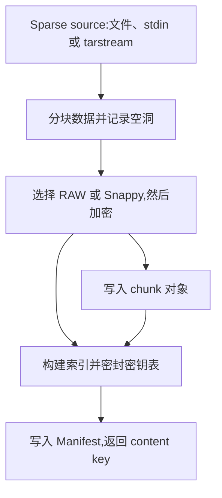

[English](manifest.md) | [简体中文](manifest_zh.md)

# manifest — 内容寻址存储的统一出入口

`manifest-ctl` 是数据进出内容寻址存储的统一入口。镜像、内存快照、磁盘和用户文件
字节可经 sparse-source API 入库;CLI `store` 专门接受 **tarstream 工件**,不直接
接受任意 raw 文件。入库产出 **Manifest**:包含 chunk 元数据与密封密钥表的小型二进制
对象。其 content key 是后续 `load` 与 `manifest://<key>` 引用的句柄;本地 Manifest
Bundle 是同一批对象的另一种载体([§2](file-artifacts_zh.md#2-多-manifest-bundle-载体))。

## 1. 概述

### 1.1 模块定位



读取方向相反:`load` 取得 Manifest、解析 chunk 列表,经配置的 cache 或直接 store
读取、解密,输出由 `crypto.local` 决定编码的 tarstream 工件。配置了 cache 就选择
该远端读路径,不代表 cache 报错时会自动绕过它直读 store。

### 1.2 设计原则

- **写入路径**:`sparse.Source → chunker → Snappy/RAW 选择 → encrypt → store.Put → Manifest`
  (Hole 段记为 manifest 空洞、不读取;Zero 段合成零字节过 chunker、免取数)
- **读取路径**:`Manifest → fetch → decrypt → io.Writer`
- **去重单位**:chunk(可变长 FastCDC 或固定长度)
- **去重域**:salt 区分收敛密钥域。chunk payload 以密文存储,但 Manifest 的
  索引/geometry 与密封密钥表容器并未整体加密。salt 隔离和加密不实现租户授权(§4.4–4.5)。

### 1.3 不做什么

- 不直接管理后端字节(委派给 [`store_zh.md`](store_zh.md));
- 不维护缓存(委派给 [cache_zh.md](cache_zh.md));
- 不感知 docker / OCI / EROFS 等高层格式(它只看字节流);
- 不做 ACL —— customer key、端点和引用的保护属于调用方/部署责任。

## 2. 命令行接口

### 2.1 公共 flag

```text
需要配置的子命令共用:
  --manifest-config string    Manifest YAML 路径,覆盖 MANIFEST_CONFIG
```

需要配置的命令必须由 `--manifest-config` 或 `MANIFEST_CONFIG` 指向有效 YAML。
**例外**:`config generate`、读取本地文件/stdin 的 `info`、本地文件 `diff`
不需要配置文件。schema 见 §3.1。该 flag 放在子命令后,不放在子命令前。

### 2.2 子命令一览

| 命令 | 功能 |
|---|---|
| `store`         | 写入数据 → 自动上传 manifest 并返回 hex content key |
| `load`          | 按 Manifest key 读取逻辑明文,并包装为 tarstream 工件 |
| `get-manifest`  | 按 hex key 取回 Manifest 原始字节(debug 用) |
| `info`          | 打印 Manifest 元数据,不解封密钥表 |
| `verify`        | 经 fetch 验证 Manifest 及所有非零 chunk 的内容与可用性 |
| `diff`          | 比较两个本地 Manifest 的 chunk 重叠度(去重率分析) |
| `config show`   | 打印解析后的配置 YAML |
| `config generate` | 输出带注释的配置模板 |

输入和 Manifest key 均为**位置参数**:`store` 数据源、`info` 来源省略或 `-`
表示 stdin。`load` / `get-manifest` / `verify` 接受完整 64 字符小写 hex key 或
`manifest://<key>`。**远端 `info` 必须带 `manifest://` 前缀**;裸 hex 在 `info`
中被当成本地文件名。flags 放在位置参数前,因为 Go stdlib flag 在首个非 flag 处停止解析。

`pkg/manifest` 同时提供 canonical ref parser。`manifest://` 只允许一个 64 位
小写十六进制 content key;多层组合必须由调用方传入显式 ref 数组并使用
`fetch.NewLayered`,不再使用 `manifest://k1:k2`。文件引用为
`file://<path>[@digest:<digest>|@hmac:<digest>|@manifest:<key>][@location:<name>]`;
三个 identity qualifier 互斥。`@manifest` 选择 Manifest Bundle 中的根 Manifest，
tarstream opener 必须拒绝它；反之 Bundle opener 必须拒绝 `@digest/@hmac`。带
location 时 path 必须是 basename,location 匹配
`[A-Za-z0-9][A-Za-z0-9._-]*`,只保存逻辑名称,不携带宿主目录。允许数字开头以直接
容纳 UUIDv7 sandbox/build ID。

### 2.3 `manifest-ctl store` — 数据写入

```
manifest-ctl store [flags] <REF|->        # <path|-> 省略或 - = stdin

Flags:
  --extra-salt string         额外 salt 字节,叠加到 store 提供的 opaque salt
  --no-progress               禁用进度输出
```

输入是一个已选定的逻辑 source：本地 tarstream 路径、带身份或 location 的 file ref、Bundle selector，或者 Manifest key/ref。多 Manifest Bundle 必须指定 `@manifest:<key>`。文件提供有界随机读取视图，stdin 使用 tarstream 的单遍 `SourceFrom` 协议；两者共用 `pkg/manifest/transfer` 的 reader/writer。空洞来自 carrier 的权威元数据。`crypto.local=off|auto|required` 沿用已有本地 tarstream 加密策略。

Store 同样接受 `--ref-location`、`--strip-tail`、`--extract-tail PATH` 和 `--append-tail PATH`，语义与下述 load 一致。发布 Store 根 Manifest 前，完成源完整性、原始顺序输入的 marker/trailer/EOF 和所请求输出文件的收尾检查。


stdout 输出一行 64 字符 hex,即已上传 Manifest 的 content key。stderr 输出动态进度
与最终人类可读摘要。**`--no-progress` 只关闭动态进度,最终摘要仍输出**。以下为示意:

```
image size:   10.0 GiB
stored bytes: 1.0 GiB
chunks:       stored=2048 dedup=18432 zero=0
compression:  raw=512 snappy=19968 logical=10.0 GiB encoded=2.1 GiB saved=7.9 GiB
manifest:     encoding=raw logical=1.8 MiB stored=1.8 MiB
manifest key: a1b2c3d4...
```

以下示例假设已提供有效配置与 customer key。`disk.img` 和 `snap.bin` 虽然使用这些
后缀,但必须已经是 tarstream 工件;文中的缩略 key 均需换成完整 key。

```bash
# 工件文件 → manifest key
MKEY=$(manifest-ctl store disk.img)

# 工件 stdin → manifest key
cat disk.img | manifest-ctl store > disk.key

# docker archive → 展平 → 入库;只上传时 stdout 为 Manifest key
docker save myapp:v1 | flatten-ctl export --upload > app.key

# 额外 salt(隔离 dedup 域;flags 在位置参数前)
manifest-ctl store --extra-salt "tenant-xyz" snap.bin

# 切换分块 / 加密模式 → 改 YAML
```

### 2.4 `manifest-ctl load` — 数据读取

```
manifest-ctl load [flags] REF...

Args:
  REF...                       自上而下的层：bare key、manifest://、本地路径、
                               file:// tarstream 或 Bundle @manifest 引用
Flags:
  --output string             输出路径 (default "-", stdout;终端拒写)
  --output-mode string        none|tarstream|bundle（默认 tarstream；带
                              --store 时默认 none）
  --store                     写入最终变换后的逻辑 source
  --extra-salt string         Store/Bundle ingest 的域隔离
  --ref-location N=file:///P  显式映射 location（可重复，P 必须绝对路径）
  --strip-tail                layering 前从每个 source 去掉 suffix ZIP
  --extract-tail PATH         保存第一个输入的原始 suffix ZIP
  --append-tail PATH          最后追加已验证 suffix；原有 tail 时要求 strip
  --name string               产物 tar 条目名 (default "image")
  --offset uint               窗口起始偏移
  --length uint               窗口长度 (0 = 余下全部)
  --no-progress               禁用进度输出
```

REF 按参数顺序通过 `fetch.NewLayered` 组合，第一个为顶层。Data 和显式零值覆盖低层，Hole 向下透传。普通本地路径可直接输入；64 字符十六进制 key 保持 Manifest 语义。同名本地文件可用 `./<name>` 指定。文件身份 qualifier 会被验证，named location 共用 `manifest.RefLocations` 解析。

固定顺序为：检查/提取原始 top tail；按需分别 strip 每个 source；分层读取；offset/length 窗口；append 新 tail。裸 source 可直接使用 `--append-tail`，原有 tail 时必须同时给出 `--strip-tail`；可识别的损坏 tail 报错。`--output-mode=none --extract-tail PATH` 仅提取有界原始元数据。tail 操作作用于逻辑内容而非外层 Bundle ZIP。保留的旧/新 tail 共用 64 MiB 预算，解码 ZIP 元数据另受限额约束。

`--store` 写入最终变换后的 source，缺省文件输出模式为 `none`，并可与两种文件输出组合。Store+Bundle 取得一次 admission，通过同一 Chunk/Manifest 编码流和有界背压写入两端；同配置得到相同物理对象及根 key。`--extra-salt` 同时适用于 Bundle-only 和 Store。Store+tarstream 通过有界管道接入既有 ingest 协议，也支持 stdin 输入。

使用命名输出文件时 Store key 输出到 stdout；二进制内容使用 stdout 时，标识和诊断输出到 stderr。Bundle root key 输出到 stderr。请求的文件以 exclusive create 直接写入；失败仅清理本次仍拥有的不完整文件。既有文件、输入输出 alias、输出路径冲突在写入前拒绝。成功结果包含源校验、文件关闭及 Store 根发布。后续目标失败可能留下已经独立完成的文件或已写入 Chunk，不影响旧源。

Tarstream 输出保留稀疏元数据。`crypto.local=off` 输出 plaintext；`auto|required` 输出 encrypted v1。不可寻址 stdin 使用 tarstream，Bundle 随机读取通过文件/ref 提供。上述 transfer 路径不生成完整镜像缓存或 staging 文件。

```bash
# 按 top → bottom 读取、合并层
manifest-ctl load --output merged.tar A B C

# 同一次操作生成相同的 Bundle 和 Store 对象
manifest-ctl load --store --output-mode=bundle --extra-salt tenant-a \
  --output merged.bundle A B C

# 合并 payload 后替换元数据尾部
manifest-ctl load --strip-tail --append-tail new-tail.zip \
  --output-mode=bundle --output merged.bundle A B C

# 只提取元数据，不输出 payload
manifest-ctl load --output-mode=none --extract-tail metadata.zip SOURCE

# stdin 同时写入 Store 和 tarstream 文件
cat source.tar | manifest-ctl load --store --output-mode=tarstream \
  --output copied.tar -
```

### 2.5 `manifest-ctl get-manifest` — 取回 manifest 字节

取得 Manifest 物理对象的原始字节,主要用于 debug 或离线 `info`/`diff`。
实际取数经过配置的 cache/store 读路径。

```
manifest-ctl get-manifest [--output -|FILE] <hex|manifest://hex>
```

```bash
# 拿出来直接看(也可直接 `manifest-ctl info manifest://<hex>`)
manifest-ctl get-manifest a1b2c3d4... | manifest-ctl info -

# 存档
manifest-ctl get-manifest --output disk.manifest a1b2c3d4...
```

### 2.6 `manifest-ctl info`

读取并打印 Manifest 摘要。来源三选一:本地文件、`-`/省略表示 stdin、
`manifest://<hex>` 表示经配置的远端路径取数。本地/stdin 不需要配置、customer key
或 store 连接;远端元数据读取需要配置和连接,但不会解封 customer key 保护的密钥表。

```
manifest-ctl info [--manifest-config <path>] <file|-|manifest://hex>
```

```
version:       1
image size:    10.0 GiB (10737418240 bytes)
chunk mode:    cdc
chunk count:   20480
zero chunks:   0 (0 B)
holes:         0 (0 B)
min chunk:     128.0 KiB    (configured)
max chunk:     1.0 MiB    (configured)
avg chunk:     512.0 KiB

size distribution (data chunks):
       min(N)          P1          P5         P25         P50         P75         P95         P99      max(N)
  63.5K(1)       128.0K      256.0K      384.0K      512.0K      640.0K      896.0K        1.0M     1.0M(412)
  (max == configured max — 412/20480 (2.0%) chunks are forced CDC cuts)
key table:     655389 bytes (sealed)
manifest size: 1802334 bytes
```

`min chunk` / `max chunk` 标 `(configured)` 是因为它们来自 Manifest 头里记录的
**配置值**,不是实测;实测分布在下面的百分位表里(只统计非 zero 的数据 chunk,
`min(N)` / `max(N)` 括号内是取到该极值的 chunk 数;最后一行仅当实测最大值正好
等于配置上限时出现,提示有多少 chunk 是被 CDC 强制切的)。

查看 store 中的 manifest 直接 `manifest-ctl info manifest://<hex>`,等价于
`get-manifest … | info -` 管道。

### 2.7 `manifest-ctl verify`

通过 fetch 路径读取并解密所有非零 chunk,验证完整 Manifest 的内容与可用性。
即使普通读取关闭校验,本命令也强制 physical SHA-256 校验。

```
manifest-ctl verify [--no-progress] a1b2c3d4...        # 或 manifest://a1b2c3d4...
```

```
verified: 20480  skipped(zero): 0  holes: 0  failed: 0  total chunks: 20480
```

### 2.8 `manifest-ctl diff` — 去重率分析

```
manifest-ctl diff <manifest-a> <manifest-b>
```

两个参数均为本地 Manifest 文件(可用 `get-manifest` 取回);diff 不打开 store,
也不加载配置或 customer key。

`shared` 与 `only in A/B` 统计不同的非零 ContentKey，不按重复 entry 位置累计。对应字节总数对每个唯一 chunk 的逻辑大小只求和一次，不是压缩/加密后的 Store 字节数。零条目与 hole 不进入这些集合；镜像大小、原始 entry 数和 hole 仍独立报告。同一 ContentKey 在单个输入内或两个输入间具有冲突的逻辑大小时拒绝比较。

CLI 的 `dedup ratio` 为 `1 - |A ∪ B| / (|A| + |B|)`，分母为空时取零。warm-pool 工作负载使用的成对重叠度（Jaccard）则为 `shared / (shared + onlyA + onlyB)`。两者都不保证通用的 VM 内存节省。以下仅为示例输出：

```
manifest A:  10.0 GiB, 20480 chunks (20480 unique)
manifest B:  10.1 GiB, 20512 chunks (20512 unique)
shared:      18432 chunks (9.0 GiB)
only in A:   2048 chunks (1.0 GiB)
only in B:   2080 chunks (1.1 GiB)
dedup ratio: 45.0%
```

### 2.9 `manifest-ctl config`

```
manifest-ctl config show     [--manifest-config <path>]
manifest-ctl config generate
```

`generate` 输出带注释模板;`show` 打印已加载的 YAML 配置,不能据此证明后端连接和
延迟构造的所有组件都能成功。

## 3. 配置

### 3.1 manifest-config.yaml

```yaml
manifest:
  key: "0a1b2c3d..."              # 占位符:32 字节 hex 客户密钥,用于密封密钥表
  verify_content: true             # 普通读取是否复验 physical Manifest/Chunk SHA-256;缺省 true
  # write_generation: G3           # 可选;指定写入 generation
store:
  endpoint: 127.0.0.1:7100        # 远端写/直接 store 读必填;离线 Bundle 可省略:host:port 或 Unix socket
                                  # (/run/sandbox/store.sock 或 unix:///...);须与 store-ctl listen 一致
  pool: 4                         # 客户端并行 grpc.ClientConn 数 (round-robin)
  timeout: 5s                     # 单次 store RPC 超时
cache:
  endpoint: 127.0.0.1:7070        # 空 = 跳过 cache 层、直接走 store;同支持 Unix socket 路径
  pool: 4
  timeout: 2s
chunker:
  mode: cdc                       # cdc | fixed
  cdc:
    min: 128KiB
    avg: 512KiB
    max: 1MiB
  fixed:
    size: 512KiB
crypto:
  chunk: aes                      # aes(唯一支持)
  manifest: aes                   # aes(唯一支持)
  local: off                      # off | auto | required;缺省 off
```

字段说明:

- `manifest.key` 是**密封 Manifest 密钥表**的 customer key,不派生 chunk 加密 key。
  丢失后无法解封该表。可不写入 YAML,由主要交付渠道 **非空 `MANIFEST_KEY`**
  提供。非空环境值覆盖 YAML;空环境值回退到 YAML。key 懒解析且不写回 Config,
  因此 `config show` 不回显环境提供的 key。**显式写入 YAML 的 key 仍在 Config
  中,可被 show 打印**。两者均空时,真正需要 key 的操作才失败。
- `manifest.verify_content` — 缺省 `true`。普通 Bundle/cache/store Fetcher、
  `GetManifestBlob` 和 `CheckManifest` 都用同一策略：`true` 时在解析 Manifest
  前复验 `SHA256(physical Manifest) == requested key`，首次读取 Chunk 时复验
  `SHA256(physical Chunk) == CiphertextHash`；`false` 时 ContentKey 只作 locator，
  不执行这两次完整对象扫描。关闭后进程只记录一次清晰 WARNING；Manifest
  envelope/geometry、key table GCM、Chunk format/长度、解密/解压等结构检查仍然
  执行。但 chunk AES-CTR 本身不是认证加密;关闭 physical hash 会去掉对应的 chunk
  内容完整性检查。`manifest-ctl verify`、Bundle full verify/upload/export 和对象修复始终
  强制开启 SHA 校验，不受该字段影响。
- `manifest.write_generation` — 可选写入 generation。有 `store.endpoint` 时，
  留空调用 `AdmitWrite()` 选择当前最新项，非空调用
  `AdmitWriteFor(generation)`，generation 已移除则失败；Store RPC 失败不会降级为
  本地派生。无 Store 的离线 Bundle writer 在字段留空时使用普通 generation 名
  `NONE`，显式配置时使用该值，两者都调用公共
  `store.SaltForGeneration` 派生 salt。`NONE` 不是保留字或协议特殊值。
- `store.endpoint` — 远端对象 I/O 经 gRPC 到 store-ctl;本地 Bundle 对象 I/O 遵守
  其独立 reader/writer 合同。取 `host:port`(TCP)或一个
  Unix socket(裸路径 `/run/sandbox/store.sock` 会被规范化为 gRPC 的
  `unix:///run/sandbox/store.sock`,显式 `unix:` 形式原样透传)——与 store-ctl
  的 `listen` 同址(同机经 socket 免 TCP 栈)。
- `cache.endpoint` — 空则 manifest-ctl `load` 路径直走 store gRPC;非空则
  通过 wire 协议穿 cache-ctl。同样接受 `host:port` 或 Unix socket 路径
  (`unix://path` 或裸 `/path`),与 cache-ctl 的 `listen` 同址。这是构造时选源,
  不是 cache 报错后自动绕过它的 failover。
- `chunker.mode` — `cdc`(FastCDC,变长)或 `fixed`(固定大小)。详见 §4.1。
- `crypto.chunk` / `crypto.manifest` — chunk 与 Manifest 的加密算法,均仅支持
  `aes`(§4.3 / §4.4);其它值在构造时即被拒绝。
- `crypto.local` — 本地存储兼容/强制 policy,不是算法选择。`off` 不启用本地
  codec,`auto` 同时接受历史 plaintext 与加密格式,`required` 只接受加密格式。
  缺省为 `off`。

### 3.2 加载顺序

**配置文件名**只来自 CLI flag 与对应环境变量,**没有自动查找**:

| 来源 | 优先级 |
|---|---|
| `--manifest-config FILE` | 非空时优先。 |
| `MANIFEST_CONFIG` | flag 为空时使用。 |
| 两者皆空 | 需要配置的命令报错;§2.1 列出例外。 |

**customer key** 有独立顺序:非空 `MANIFEST_KEY` 覆盖 YAML `manifest.key`。
共享配置可以省略 key,由其他渠道单独交付。

`pkg/manifest.ParseConfig` 还支持**内存 YAML 字节**,例如 config socket 向
sandbox-ctl 投递配置,endpoint/crypto 不必落盘。调用方可单独设置
`Config.Manifest.Key`;若随后使用 `CustomerKey()`,环境覆盖规则仍适用。

没有 chunker/crypto 单字段 CLI override;通过修改 YAML 调整。

## 4. 设计

### 4.1 chunking

把字节流切成可去重单位。两种模式:

#### FastCDC (cdc)

变长内容定义分块,基于 rolling hash + Gear 表选择切点。

| 参数 | 默认 | 说明 |
|---|---|---|
| `min` | 128 KiB | 最小切点长度;数据段最后一个片段可更短 |
| `avg` | 512 KiB | 期望平均长度;Gear mask 按此值设置 |
| `max` | 1 MiB   | 切点的最大长度;到此强制切 |

这些尺寸及 fixed `size` 必须是 4 KiB 的整数倍,由 chunker 构造器验证;
单纯 YAML 解析不等于构造有效 chunker。Manifest ingester 还限制 decoded chunk
最大为 64 MiB。

内容定义切点可在**插入/删除**后重新对齐,保留修改区域之外的去重机会。但本实现按
4 KiB 对齐切点,扰动范围取决于编辑、对齐、sparse 分段与内容,不能保证任意单字节
插入只影响固定少量 chunk。

#### Fixed-size (fixed)

固定分块默认 512 KiB,布局简单、可预测;插入/删除若移动后续固定边界,可能显著降低
去重率。它可用于性能基线或可预测布局;内容复用默认使用 CDC。相对速度与命中率仍取决于负载。

切换模式修改 YAML `chunker.mode`,命令接口不变。

### 4.2 收敛加密(convergent encryption)

不变量为 **相同明文 + 相同 salt 生成相同密文**,允许共享 dedup 域复用 chunk。
chunk payload 被加密,但不是所有 Manifest 字段都保密,也不阻止 store 推断重复内容。

#### Key 派生

```
salt = server_salt (+ extra_salt mixing)   # 见 §4.5
key  = SHA256(salt || plaintext)           # convergent key
```

AES-CTR 的 IV 取全零。key 始终由**原始 plaintext**派生,而固定 canonical
encoder 又保证同一 plaintext 只对应一个 RAW 或 Snappy payload,因此受支持的 canonical writer 不用同一 `(key,
IV=0)` 加密两个不同的编码 payload。下述相同/不同 key 与 hash 推论依赖哈希假设。由 `salt + plaintext` 决定 chunk 的密钥,
同 salt 域内同 plaintext 必然产出同 physical object;同 object → 同
ContentKey(= `SHA256(object)`)→ store 上同一份字节。

此不变量要求 Go Snappy 版本、`snappy.Encode`、收益门槛和格式规则固定。当前 reader
拒绝旧开发布局;不能在同一 salt/key 域混用不兼容 writer。未来修改 encoder 输出或门槛
需要域分离与明确评审的迁移方案,仅换 format byte 不够。核验所选版本的 reader/writer
兼容性,保留既有资产与回滚数据,不能把过时的“尚未发布”备注当作删除在线 salt 域的依据。

canonical encoder 固定为 `github.com/golang/snappy` v1.0.0 的 block API。相同
输入的 encoded bytes 由 amd64、amd64 `noasm` 与 arm64 golden 共同约束；这项
逐字节一致性优先于更高压缩比。`klauspost/compress/s2` 的标准及 Snappy-compatible
encoder 会因架构实现产生不同 block bytes，因此不用于 canonical 写路径。

#### Content key

Chunk 上传时,`SHA256(physical_object)` 是 store 的寻址键;Manifest 上传时同样
按 `SHA256(physical_envelope)`。Salt **不参与寻址** —— 寻址完全由物理字节哈希决定,
保留 salt 的隔离性,但允许 store 端以单一 KV 视图存储(详见 [`store_zh.md`](store_zh.md))。

### 4.3 加密模式 — chunk

YAML `crypto.chunk` 仅支持 `aes`;任何其它值在构造时即被拒绝(无明文回退)。
每个非零 chunk 固定执行 Go Snappy block `snappy.Encode`。仅当同时满足以下 canonical
门槛才选 Snappy,否则选 RAW；这不是配置项：

```text
saved = rawSize - encodedSize
Snappy iff saved >= 4 KiB AND encodedSize * 4 <= rawSize * 3
```

物理格式：

| format byte | payload | physical object |
|---|---|---|
| `0x01` (`AESRaw`) | 原始 plaintext | `[0x01] || AES-256-CTR(key, IV=0, plaintext)` |
| `0x02` (`AESSnappy`) | `snappy.Encode(plaintext)` | `[0x02] || AES-256-CTR(key, IV=0, snappy_block)` |

chunk key 为加密层内部派生的 `SHA256(salt‖plaintext)`,调用方只传 salt,不传 key。
在哈希假设及 canonical 合同下,不同明文使用不同 key,不故意重用 CTR keystream。
format byte 未加密但被 physical ContentKey 覆盖。Manifest entry 仍只记录原始
plaintext size 与完整 physical hash,不增加 codec 字段。unknown format、长度不
匹配、截断、非法 Snappy block 或不满足固定收益门槛的 Snappy object 一律失败,
没有格式猜测或 fallback。开启 SHA 校验时,被改动的物理对象会失败;关闭它后,
AES-CTR 和结构检查不能认证所有可能的明文损坏。

### 4.4 加密模式 — Manifest

Manifest 中**密钥表 (key table)** 是一段编码了所有 chunk 加密 key 的二进
制:

| 模式 | 行为 |
|---|---|
| `aes` | AES-GCM 用 `manifest.key` 和 Manifest AAD 密封 key table,customer key 解封 |

保护的是 key table,不是整个 Manifest 索引;对象不会直接给 store 提供 customer key。
但 chunk key 独立于 customer key,由 salt 与明文派生。掌握相应 salt 且能猜测明文的
主体可以派生候选 key 并检验对应对象;同域去重还会暴露相等性。因此只保护 customer key
不构成“永远无法推断 chunk 内容”的普遍保证。按部署信任边界保护 key/salt、引用与服务授权。

### 4.5 Salt 与 dedup 域

Salt 隔离 dedup 域 —— 同样的明文用不同 salt 派生不同 key → 不同 ciphertext
→ 不同 ContentKey → store 上是两份。

实际 salt 由两部分组合:

- `server_salt` — 每次 ingest 获得一次 write admission,默认 `AdmitWrite()`,显式
  write generation 则用 `AdmitWriteFor`,取得 generation
  与 opaque salt；全部 chunk 和最终 manifest Put 复用该 admission。切换写入
  generation 后，新 ingest 使用新的 salt，已开始的 ingest 不会跨代。
- `extra_salt` — `--extra-salt <bytes>` flag(§2.3),叠加到上面。

最终:

```
final_salt = server_salt                                                       # extra_salt 为空
final_salt = SHA256("accelerator-extra-salt-v1" || server_salt || extra_salt)  # extra_salt 非空
```

`extra_salt` 在同一 store generation 中建立更细粒度去重域,例如按租户;它不是 ACL。

### 4.6 Manifest 二进制格式

Manifest 的当前 Version1 physical envelope 是：

```text
[4 bytes "MANI"][1 byte encoding][payload]

encoding 0x00 (RAW): payload = logical manifest bytes after magic
encoding 0x01 (Snappy):  payload = snappy.Encode(logical manifest bytes after magic)
```

RAW/Snappy 使用与 Chunk 相同的固定 4 KiB + 75% 收益门槛。reader 不接受旧的
`[MANI][Version1]...` 表示。Snappy decode 前先调用 `snappy.DecodedLen`,完整 logical
manifest（含 magic）硬限制为 64 MiB；encoded length、table offset/length 和所有
整数加法均先做边界检查，并拒绝不满足固定收益门槛的 Snappy envelope。RAW 直接在
envelope payload 上解析,不为重建旧布局复制
完整 Manifest；Snappy 只保留一个有界 decoded buffer。

envelope 内的 logical Manifest 是一段紧凑二进制(整数 little-endian；magic 本身
是字节串 `MANI`)：

| 区域 | 布局 |
|---|---|
| Header,64 B | `magic[4]`、`version u8`、`chunk_mode u8` 与 reserved padding;`image_size u64`、`chunk_count u32`、配置的 `chunk_min/max u32 × 2`;key-table offset/length、hole count/offset,补 reserved 到 64 B。模式 1=CDC、2=fixed。 |
| Chunk index,每项 56 B | `image_offset u64`、`plain_len u32`、`flags u32`(bit0=zero chunk)、`cipher_hash[32]`、**8 B reserved zero**。按 image offset 排序。 |
| Hole,每项 16 B | `offset u64`、`size u64`;与 data entries 精确铺满 `[0,image_size)`。 |
| Key table | customer key 通过 AES-GCM 密封非零 chunk keys:`key_0[32],key_1[32],...`。 |

零 chunk(明文全零,flags bit0)不加密、不入库、不占密钥表条目,读取时本地
合成零字节;hole 是外部声明的"无数据"区间(文件系统空洞等),与数据 chunk
无重叠、无缝隙地铺满整个镜像。

普通读取在 `manifest.verify_content=true` 时先验证 physical envelope 的 SHA-256
与 requested ManifestKey,然后解析。读取 header/index,二分定位 chunk,解封密钥表,
经 cache/store 按 cipher_hash 取数,解密后输出逻辑字节。关闭普通校验会按 §3.1 跳过
hash 步骤;显式 verify 始终强制开启。

### 4.7 写路径(细节)

下表描述单个逻辑 chunk 的顺序;不同 chunk 的加密与上传并发执行。

| 阶段 | 操作 |
|---|---|
| Sparse 输入 | Hole 记录后跳过;Zero 不取 payload,本地合成。 |
| 分块 | 对连续非 Hole 段按 CDC/fixed 切分。 |
| 派生 key | `key = SHA256(salt || original_plaintext)`。 |
| 编码 | 计算 Go Snappy 候选,按固定收益规则选择 RAW/Snappy。 |
| 加密 | AES-CTR 加 format byte,得到 physical object 与 SHA-256。 |
| 寻址 | 复用 crypto 返回的 physical hash 为 ContentKey,ingest 不重复 hash。 |
| 上传 chunk | `store-ctl Put(admission, partition=chunk, key=ContentKey, size, ciphertext)`。服务端先查 Exists,去重命中可不上传 body。fs backend 写 `chunk/{generation}/aa/bb/<hash>`;其他 backend 遵守各自布局。 |
| 元数据 | 按逻辑顺序追加 chunk metadata 与 key。 |
| 密封 | 用 customer key 与 Manifest AAD 密封 key table。 |
| 信封 | 逻辑 Manifest 编码为 canonical RAW/Snappy physical envelope。 |
| 发布 | 使用**同一 admission**,在 Manifest partition Put。 |

derive/encode/encrypt/Put 使用**有界 worker pool**,worker 数来自 writer 的
`PoolSize()` 能力。标准 store client 对应 `store.pool`;未暴露能力的 writer
使用 1 个 worker。这是 ingest 实现选择,不代表一个 gRPC connection 只能并发一个 RPC。

chunking 顺序执行,index 按 source 顺序组装,进度回调串行化;Put 乱序完成不会打乱
Manifest。完整字节复现还要求相同 sparse 输入、chunker/codec 设置、salt/admission
及 customer key/AAD;并发顺序本身不能证明跨配置确定性。有界并发可重叠多 GiB 快照的
后端往返;测量入口见[项目性能文档](https://github.com/kuasar-sandbox/kuasar-sandbox/blob/main/docs/perf_zh.md),
没有固定负载与运行记录时不承诺具体吞吐收益。

### 4.8 读路径(细节)

| 接口/阶段 | 职责 |
|---|---|
| Manifest key | on-demand Getter 读取 Manifest partition 对象。 |
| Metadata | 解析 index,解封 key table。 |
| Stream | 单 Manifest 对应单 Stream;调用方用 `NewLayered` 显式组合 top-to-bottom 数组。 |
| `RunAt` | 解析可执行 sparse Run:Hole/Zero/Data;Manifest Data 额外实现 `fetch.ChunkRun`。 |
| `ResolveChunkWindow` | 可选地在最终可见视图中扩展一个物理 chunk。 |
| `Run.ReadAt` | 读取已解析的单个可见 Run。 |
| `Stream.ReadAt` | 先收集 Run,再并发读取可见 Data,经 on-demand Getter、按策略校验/解密及有界明文 chunk cache。 |
| 可选 `Prefetcher.Prefetch` | 经 prefetch Getter 预热 cache/store 对象,立即 Release。 |

`Stream.RunAt` 返回不可变的 `sparse.Run`,其逻辑范围为
`[Offset(), End())`,`Run.ReadAt` 使用相对 `Offset()` 的 inner offset,且拒绝
跨越 `End()`。`RunAt` 只查询 sparse map、manifest index 或 tar extent map,
不读取 payload,不调用 cache/store Get,也不校验、解密或改变一次性 source 的
读取位置。manifest Data Run 保存首次解析得到的 chunk index,并额外实现
`fetch.ChunkRun`;Hole、Zero 和 tar/file Data Run 只实现普通 `sparse.Run`。

`fetch.ResolveChunkWindow(stream, anchor, maxBytes)`为需要复用一次物理chunk读取的
调用方提供可选的双向元数据解析。`anchor`必须来自同一个最终组合`stream`的
`RunAt`;当物理chunk不大于`maxBytes`时,helper返回包含anchor、由同一物理chunk
服务的最大连续最终可见窗口。上层Hole透明,上层Data或Zero为硬边界,根Stream的
`Size()`也是硬边界;同一下层chunk被opaque区段分开后不会跨区段合并。解析过程不
调用payload Getter,不校验、解密或解压。超出上限或无法识别物理身份的包内
`ChunkRun`保持原anchor不变,调用方仍可使用原有forward语义。

`Stream.ReadAt` 先收集覆盖请求窗口的全部 Run,完成解析后再修改目标 buffer;
随后只对 Data Run 并发调用 `Run.ReadAt`,Hole 和 Zero 直接填零。多层 Stream
采用 top-to-bottom 可见性:Data 和 Zero 遮挡下层,只有 Hole 或超出层大小才继续
向下。每个 upper Hole 会先收紧 bound,命中后直接返回最终 child Run,因此嵌套
overlay 不丢失 `ChunkRun` 能力,下层 chunk 也不能越过任一上层重新出现内容的
位置。部分读(`--offset` / `--length`)只触发涉及窗口的物理 chunks,不会扫描或
物化完整镜像。

支持预取的 Stream 额外实现 `fetch.Prefetcher`。`Prefetch(ctx)` 遍历整个逻辑
Stream,只对最终可见且实现包内 prefetch 能力的 `ChunkRun` 调用完整物理
chunk 的 cache Get;普通 Data Run、Hole 和 Zero 都是 no-op。成功命中后立即
Release,不读取 Blob、不校验、不解密、不 pin。预取作用于当前组合 Stream 的
完整可见视图,不再提供按 manifest key 选择叶子的接口。

同一 Fetcher 的 manifest metadata、普通 ReadAt 和所有 Stream 共用一个底层
Getter 与请求调度器。on-demand 请求从不等待已开始的 prefetch;存在任意
on-demand 时不再准入新的 prefetch,且每个 Fetcher 最多一个 prefetch Get 在
途。已开始的 prefetch 不抢占,可与后来到达的 on-demand 短暂重叠。不同
Fetcher 相互独立,调度器不创建后台 goroutine,也不拥有底层 Getter 生命周期。

每个 manifest Stream 内部维护独立的解密 chunk cache,仅服务 on-demand 部分读。
cache key 包含 `CiphertextHash`、chunk decrypt key 和 plaintext size,因此同一
Stream 内重复物理内容可以复用,不同密钥或逻辑大小不会错误别名。cache 同时受
`32 entries` 和 `32 MiB` 两个硬预算约束,按 LRU 淘汰;entry 自最后一次命中起空闲
`5s` 后过期。每个 Stream 只保留一个指向最早到期 entry 的 timer,即使后续没有
读请求也会主动回收陈旧数据,不为每个 entry 创建 timer 或常驻扫描 goroutine。

同一 cache key 的并发 miss 合并为一次 Get、按策略执行的 SHA-256 校验、解密和可选 Snappy
decode,不同 key 仍可并行加载。加载失败不进入 cache;等待者如果自身 context 仍有效会重新尝试,不会
永久继承首个加载者的取消。partial miss 只分配一个 plaintext-sized cache buffer,
在 immutable Blob 仍存活时直接写入该 buffer；不复制或修改 ciphertext。淘汰、TTL
到期和 `Close()` 都会清零明文;正在复制
的 entry 先从 LRU 移除,待最后一个 reader 释放后再清零。

冷态完整物理 chunk 读取保持直通路径,避免一次性顺序扫描污染 cache;已有 cache
命中仍可服务完整读取。单个 plaintext chunk 超过 `32 MiB` 时同样直通且不准入。
RAW 整块由 AES 直接写 caller buffer,没有 plaintext allocation 或额外整块 copy；
RAW 超大 partial 按 CTR block/offset 直接解密请求范围。Snappy 整块把 encrypted payload
解到有界 encoded scratch,校验 `DecodedLen == entry.Size`,再直接 decode 到 caller
buffer；Snappy 超大 partial 因 block format 限制必须完整 decode 到有界临时 plaintext
后复制范围。

Snappy encoded scratch 使用显式 size class free-list,不是无峰值保证的 `sync.Pool`。
encode/decode 分别有独立的 `max(1, GOMAXPROCS)` CPU slot、192 MiB active byte budget
和 64 MiB retained budget（每方向合计最多 256 MiB codec-owned scratch）；常用最大
retained buffer 为 2 MiB,异常大 buffer 用后丢弃。slot 和 weighted byte admission
都响应调用方 context；RAW 读取不获取 decode slot。没有后台 goroutine。

`Prefetch` 仍只执行完整物理 chunk 的 cache Get 并立即 Release,不校验、解密或
填充上述明文 cache。因此 Prefetch 与 on-demand ReadAt 可以各自产生 Get,而重复
的 on-demand 部分读由 Stream 内部合并和复用。


## 5. 性能特征

[项目性能文档](https://github.com/kuasar-sandbox/kuasar-sandbox/blob/main/docs/perf_zh.md)
提供冷/热 L1 下 `manifest://` 端到端加载的测量背景。记录实际 revision、负载和 cache
状态;章节位置或 benchmark 名称本身不构成新的实测结果。

主要变量:

- chunk 模式:CDC 可提高修改后的复用率,但有分块成本;相对 fixed 的优势取决于负载。
- 固定 RAW/Snappy 与 AES:不可压缩内容保持 RAW,可压缩内容减少 physical hash/AES/wire 字节。
- store 延迟及 backend 行为,例如本地 fs 与远端 S3-compatible object storage,见 [store](store_zh.md)。

可重复 microbenchmark 为 `BenchmarkCompressionCandidates`(RAW、Go Snappy、S2、
S2 Better、Zstd SpeedFastest 对照组)、`BenchmarkAESChunkCanonicalCodec` 和
`BenchmarkManifestAESPhysicalRead`。只有 Go Snappy 进入生产 codec,候选 benchmark
不是配置/协商项。`scratch-misses/op` 可检查 warm size class 是否复用 payload-sized buffer。

Bundle tail-index 的 4K/20K/100K 打开成本由 `BenchmarkBundleOpen4K`、
`BenchmarkBundleOpen20K`、`BenchmarkBundleOpen100K` 报告。Open 只加载 Manifest
index,不读 Chunk index、Central Directory、对象 Local Header 或 payload。
`BenchmarkBundlePrepareChunks4K/20K` 测量选源后一次 Chunk section 准备;
`BenchmarkBundleGetAfterPrepare` 测量 O(1) lookup 加 payload read。

`BenchmarkBundleOpenHighRTT20K` 注入固定 ReaderAt RTT,报告 `read-calls/op` 与
`read-bytes/op`。`BenchmarkVerifyContent` 比较校验开/关时 Manifest Open 和冷态
1 MiB chunk 读取。

`BenchmarkManifestSourceSearch` 测量 refs 为 0/1/8/32 时 clean miss 与最终 remote
fallback。`BenchmarkMetadataOpen4K` / `BenchmarkMetadataOpen20K` 测量 prefix-only
metadata 读取及其与 chunk 数的关系。benchmark fixture 名称不覆盖容器 entry 上限。

## 6. See Also

- [store](store_zh.md):manifest-ctl 经 store-ctl gRPC 写入远端字节。
- [cache](cache_zh.md):可选读取加速;cache-ctl 可用同款 store client 作为 origin。
- [guest-runtime flatten](https://github.com/kuasar-sandbox/guest-runtime/blob/main/docs/flatten_zh.md):镜像展平后经 `flatten-ctl export --upload` 入库。
- [sandboxer](https://github.com/kuasar-sandbox/sandboxer/blob/main/docs/sandbox_zh.md):磁盘 base 与快照的 Manifest key 引用。
- [系统架构](https://github.com/kuasar-sandbox/kuasar-sandbox/blob/main/docs/kuasar-sandbox_zh.md):Manifest 抽象在平台中的位置。

不可变读取错误及 client 恢复见[读取错误与恢复](accelerator-read-recovery_zh.md).
